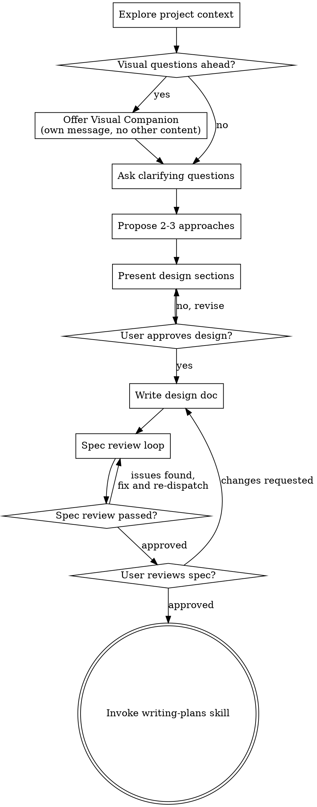

# Conversation Transcript

**Date:** Sunday, April 19, 2026 at 2:17 AM -03
**Project:** cosmo-smoke
**Session:** `9668fa8b-a27...`

---

## User

<local-command-caveat>Caveat: The messages below were generated by the user while running local commands. DO NOT respond to these messages or otherwise consider them in your response unless the user explicitly asks you to.</local-command-caveat>

## User

<command-name>/clear</command-name>
            <command-message>clear</command-message>
            <command-args></command-args>

## User

triage ideas

## User

# /triage — Master Session Orchestrator

Unified command that scans every source of pending work, detects lifecycle gaps, scores by priority, and executes the chosen task after confirmation. Replaces `/what-now` as the recommended session entry point.

## Usage

```bash
/triage                          # Full analysis + recommendation
/triage security                 # Focus on security-related work
/triage "ship the audit system"  # Natural language priority steering
/triage FEAT-200                 # Focus around a specific item
/triage --quick                  # Skip reasoning, top 3 only
/triage --scope issues           # Only score issues
/triage --scope feedback         # Only score feedback
/triage --no-execute             # Advisory only, don't offer to start
```

## Instructions

### Step 1: Parse Arguments

| Argument | Effect |
|----------|--------|
| (none) | Full analysis across all sources |
| free text | Natural language focus — boost matching items |
| `FEAT-xxx` / `BUG-xxx` / `ROAD-xxx` | Center analysis around specific item |
| `--quick` | Skip detailed reasoning, show top 3 with scores only |
| `--scope X` | Limit gathering to one source type |
| `--no-execute` | Advisory only — recommend but don't offer to start |

### Step 2: GATHER — Collect All Pending Work

Run **one command** to gather from all sources in parallel:

```bash
ccs triage gather                    # All sources, unified JSON
ccs triage gather --scope issues     # Only issues (respects --scope flag)
```

This returns unified JSON with: `git_status`, `issues`, `feedback`, `ideas`, `prompts`, `roadmap`, `quick_wins`, `triage_history`. Any source that fails is reported in `errors[]` without blocking others.

If `--scope` is set, pass it through: `ccs triage gather --scope {scope}`

Also run in parallel (separate Bash call): `ccs workcheck --json` for session goal status (not covered by gather).

### Step 3: ANALYZE — Score and Detect Gaps

For each gathered item, perform two analyses:

#### Lifecycle Detection

Check where each item sits in the pipeline:

```
Raw → Captured → Brainstormed → Planned → Prompted → Executable → Done
```

| Item State | How to Detect | Gap Action |
|-----------|---------------|------------|
| Idea with no brainstorm | No matching file in `docs/brainstorming/` | `/brainplan` |
| Brainstorm with no plan | No linked file in `docs/planning-mode/` | Write plan |
| Plan with no prompt | No linked file in `docs/prompts/` | `/continuation-prompt` |
| Prompt with independent tasks | Plan mentions 2+ non-dependent tasks | `ccs glm-agent exec-batch` |
| Prompt with complex tasks | Tasks need judgment/architecture | `/run-continuation` |
| Bug with no investigation | Open, no linked commits | `/bug-fix BUG-xxx` |
| Feedback not triaged | Status: pending | Process or `ccs feedback convert FB-xxx --to-feature` (or `--to-bug`, `--to-idea`) |

Detect lifecycle links via YAML fields (`brainstorm_ref`, `plan_ref`) or filename matching in `docs/brainstorming/`, `docs/planning-mode/`, `docs/prompts/`.

**Fallback defaults:** If `gather` does not return a `lifecycle_stage` for an item, default to `"captured"`. If `deferral_count` is missing, treat as `0`.

#### Priority Scoring

**Base weights:** Uncommitted (100), session goals (90), blocking items (85), critical bugs (80), pending prompts (70), roadmap active (60), feedback (50), quick wins (45), needs planning (40), ideas (30).

**Modifiers:** Deferred 3+ times → 1.5x. Age >7d → 1.2x. Matches focus arg → 1.5x. Recent commit type bias. Stuck in lifecycle stage → 1.2x.

If `--quick`, skip reasoning — just rank by score.

### Step 4: RECOMMEND — Present Results

Use this output format:

```
🎯 /triage
━━━━━━━━━━━━━━━━━━━━━━━━━━━━━━━━━━━━━━

Focus detected: {inferred from recent commits, or "none" if broad}

📍 #1: {action} {ID} — {title}
   Why: {2-3 sentence reasoning}
   Stage: {current} → needs {next stage}
   Score: {score}

   Also available:
   ├── #2: {ID} — {title} ({type}, score {N})
   ├── #3: {ID} — {title} ({type}, score {N})
   ├── #4: {ID} — {title} ({type}, score {N})
   └── #5: {ID} — {title} ({type}, score {N})

   {if any items deferred 3+ times:}
   ⚠️ Deferred {N}x: {ID} — {title} (close or fix?)

   Scanned: {N} uncommitted, {N} session goals, {N} bugs, {N} features,
   {N} feedback, {N} ideas, {N} roadmap items, {N} pending prompts
```

If `--quick`, show only the top 3 with scores — no reasoning or lifecycle details.

If `--no-execute`, stop here. Otherwise, present options via AskUserQuestion:

- **Header**: "Next action"
- **Question**: "Start #1, or pick a different item?"
- **Options**: "Start #1" | "Pick # (specify)" | "Skip all"

### Step 5: EXECUTE — Smart Depth Dispatch

Based on the confirmed choice, dispatch at the appropriate depth:

| Item Type | Execution |
|-----------|-----------|
| Uncommitted work | Run `/commit-all` |
| Has continuation prompt | Run `/run-continuation --yes` for that prompt |
| Needs brainstorming | Run `/brainplan {topic}` |
| Needs planning (has brainstorm) | Invoke `superpowers:writing-plans` |
| GLM-dispatchable | Show `ccs glm-agent exec-batch` command, confirm |
| Trivial (feedback ack, idea archive) | Auto-execute, report result |
| Quick win (small scope) | Load context, create TaskCreate items, start work |
| Complex (multi-system) | Load context, explain scope, create tasks, hand off to user |

After starting execution, create a TaskCreate for the chosen work item to track progress.

### Step 6: RECORD — Update History

Use `ccs triage history record` to persist triage outcomes:

```bash
# Mark item as seen (all displayed items)
ccs triage history record FEAT-276 seen

# Mark item as accepted (chosen for execution)
ccs triage history record FEAT-276 accepted

# Mark item as deferred (explicitly skipped)
ccs triage history record FEAT-276 deferred
```

Call `ccs triage history record {ID} seen` for every item shown in the recommendation list. Call `record {ID} accepted` for the chosen item, or `record {ID} deferred` for items the user explicitly skips. Items no longer in any source are pruned automatically by the history system.

## Key Rules

- **One clear recommendation** — don't dump the entire inbox
- **Be specific** — "/brainplan FEAT-200" not "consider planning something"
- **Context-aware** — read recent commits to detect current focus
- **Fast gathering** — all CCS commands in parallel, don't re-read what's in context
- **Lifecycle-aware** — the killer feature is detecting WHERE items are stuck, not just listing them
- **History-aware** — items you keep skipping get escalated

## What It Replaces

`/what-now` — `/triage` is the smarter, lifecycle-aware, history-tracking successor.

## Related

`/what-now` - `/whatsup` - `/workcheck` - `/run-continuation` - `/brainplan` - `ccs inbox`


## Assistant

Running triage with focus on **ideas**.

## Assistant

🎯 **/triage — ideas scope**
━━━━━━━━━━━━━━━━━━━━━━━━━━━━━━━━━━━━━━

Focus: v0.7 just shipped (WebSocket, monorepo, gRPC build tag). Ideas are all **seed** status — none have brainstorm docs.

📍 **#1: IDEA-MO1FBPJB — Trace correlation with OpenTelemetry**
   Why: Aligns with observability trend; complements the new response_time_ms + service_reachable assertions. Highest ecosystem value for a smoke test tool.
   Stage: seed → needs brainstorm
   Score: 42

   Also available:
   ├── #2: IDEA-MO1FBRNZ — Portfolio smoke dashboard (seed, score 38)
   ├── #3: IDEA-MO1FC22M — Mobile app deep link assertion (seed, score 35)

   Scanned: 3 ideas, 0 brainstormed, 0 planned

**All 3 are stuck at seed** — none have `docs/brainstorming/` files. Next step for any of them is `/brainplan`.

## Assistant

Launching `/brainplan` for the OpenTelemetry trace correlation idea.

## User

# /brainplan — Brainstorm, Plan, Prompt in One Session

A session commitment: deeply think through a feature, write a plan, and produce a continuation prompt. By session's end, 3 linked artifacts exist and the next session can execute.

## Usage

```bash
/brainplan                                    # Brainstorm the current conversation topic
/brainplan add a notification system          # Brainstorm a new topic (free-form)
/brainplan --brainstorm-only "idea"           # Stop after design doc
/brainplan --plan-only                        # Skip brainstorm (design doc already exists)
/brainplan --from docs/brainstorming/...      # Start from existing brainstorm doc
/brainplan --no-glm-tasks                     # Skip GLM dispatch manifest generation
/brainplan --autopilot "idea"                 # Heavy mode: TDD scaffolds + radius + post-write score gate ≥85
```

## Output Guarantee

By completion, `/brainplan` produces 3 committed, linked artifacts (+ optional 4th):

```
docs/brainstorming/YYYY-MM-DD-<topic>.md           ← Design doc (Q&A, decisions, architecture)
docs/planning-mode/YYYY-MM-DD-<topic>.md           ← Implementation plan (bite-sized tasks, TDD)
docs/prompts/YYYY-MM-DD-<topic>.md                 ← Continuation prompt (goals, file scope, refs)
docs/prompts/YYYY-MM-DD-<topic>-glm-tasks.yaml     ← GLM dispatch manifest (if 2+ independent tasks)
```

## Instructions

### Step 0: Determine Topic

| Input | Action |
|-------|--------|
| No arguments | Scan conversation for active topic, confirm: "Brainstorming [topic] — correct?" |
| Free-form text | Use as the topic directly |
| `--from <path>` | Load existing brainstorm doc, skip to Phase 2 |
| `--plan-only` | Scan `docs/brainstorming/` for latest unplanned doc, skip to Phase 2 |
| `--brainstorm-only` | Run Phase 1 only, stop after design doc |
| `--no-glm-tasks` | Skip GLM dispatch manifest generation (Phase 3.5) |
| `--autopilot` | Enable autopilot mode (FEAT-363): per-task radius Q&A, TDD scaffolds, find/replace patterns, persona + coverage_budget frontmatter, post-write score gate ≥85. See Phase 1.75 and Phase 2.5 below. |

### Phase 1: Brainstorm

#### Phase 1 Pre-Scan: Related Content

Before starting the interactive brainstorm, scan for related content:
- `ls docs/bookmarks/ docs/research/ 2>/dev/null` — check if directories exist
- If they exist, grep for topic keywords across those directories
- Surface any relevant findings: "Found N related bookmarks/research docs that may inform this design"
- Pass relevant findings as context to the brainstorming skill

Invoke the `superpowers:brainstorming` skill via the Skill tool.

Follow its full workflow: explore context, ask clarifying questions (one at a time), propose approaches, present design, get approval, write design doc.

**Idea capture**: During the interactive Q&A, when secondary ideas emerge that aren't part of the main design, file them immediately:
`ccs idea add "<idea title>" --source agent --trigger "brainplan: <topic>" --body "<brief context>"`
Don't wait until the end — ideas get lost if not captured in the moment.

**Output**: `docs/brainstorming/YYYY-MM-DD-<topic>.md`

After the design doc is written and committed, capture its path as `$BRAINSTORM_PATH`.

**If `--brainstorm-only`**: Stop here. Report the saved path and exit.

### Phase 1.75: Autopilot Mode Enhancements (if `--autopilot`)

When `--autopilot` is set, extend the brainstorm with blast-radius Q&A per task. Ask two extra questions for **every** task the user confirms:

1. **"What files/dirs does this task touch?"** — Answer becomes `touches:` (prefixes end in `/`, specific files don't). Validate format: no globs like `**`.
2. **"What tests must stay green while this runs?"** — Answer becomes `must_keep_green:` (Go package paths with `./...` suffix). These fire DURING the GLM loop as a mid-run verification gate (per S278 memory).

Also ask once up front:
- **Persona**: `bug-hunter`, `feature-builder`, or `refactor-specialist` (pins GoRalph persona at plan time).
- **Coverage budget**: total wall-clock budget for the autopilot run (e.g. `30min`, `2h`).

Pass these into Phase 2 so the writing-plans skill writes them as frontmatter + per-task fields.

### Phase 1.5: Codebase Gap Check

Before planning, check what already exists:
- Run `ccs find-func` and `ccs find-type` for topic-related terms
- Grep for related files in `cmd/`, `internal/`, `plugins/`
- If existing code found, report: "Found existing <file> (<N> lines) — plan should extend, not replace"
- Pass findings as context to the writing-plans skill

### Phase 2: Plan

Invoke the `superpowers:writing-plans` skill via the Skill tool.

The brainstorm doc is already in context — the writing-plans skill reads it to produce the implementation plan.

**Output**: `docs/planning-mode/YYYY-MM-DD-<topic>.md`

**When `--autopilot` is set, the plan MUST include:**
- Top-level frontmatter: `autopilot: true`, `autopilot_target: 85`, `persona: <chosen>`, `coverage_budget: <budget>`.
- Per-task frontmatter block (YAML inside the task body, or a `tasks:` array at top): `touches:`, `must_keep_green:`, `acceptance:` (machine-verifiable — test name / ccs command + expected exit / build status — no natural language), `estimated_min:` ≤30.
- Inline TDD test scaffolds for each task (stub `func TestX_Y(t *testing.T)` with expected signatures) instead of prose descriptions.
- Exact find/replace snippets (diff blocks) when modifying existing code — not "update line ~42".
- Explicit "Stop when:" condition per task wired to one or more must_keep_green checks.

After the plan is written and committed, capture its path as `$PLAN_PATH`.

**Enrich the brainstorm doc** with a back-reference to the plan:
- Read the brainstorm doc's frontmatter
- Add `plan: <$PLAN_PATH>` to the YAML frontmatter
- Commit the update

### Phase 2.5: Autopilot Post-write Score Gate (if `--autopilot`)

After the plan is committed, run the autopilot-readiness scorer:

```bash
ccs prompts score "$PLAN_PATH" --write
```

`--write` persists `autopilot_score`, `autopilot_ready`, `autopilot_hash`, `autopilot_scored_at` onto the plan's frontmatter.

Read the printed score. Decision logic:

| Score | Action |
|-------|--------|
| ≥85 | ✅ Autopilot-quality. Commit the frontmatter update. Proceed to Phase 3. |
| 70–84 | ⚠️ Dispatchable but below autopilot target. Identify the lowest-scoring dimension from the printed breakdown. Surface the weak tasks to the user and offer to regenerate them with tighter Q&A. If the user says "ship it", commit the frontmatter update, log `autopilot_override: true` via `ccs lessons append --type autopilot_override ...`, and proceed. |
| <70 | ❌ Below GoRalph threshold. Loop back: identify which dimension tanked (often `blast_radius` or `testability`), regenerate those tasks, re-score. Max 3 regen loops — if still below 70 after 3, surface to user for manual rewrite. |
| BLOCKED | ❌ Hard blockers present (missing required frontmatter, no tasks, DRAFT status). Fix the blockers directly and re-score. Never ship a blocked plan. |

The gate exists to enforce the FB-487 hard constraint: plans handed to GoRalph autopilot must be machine-verifiable end-to-end. A plan that scores 60 with natural-language acceptance criteria is the exact "looks good, doesn't work" failure mode this feature was built to prevent.

### Phase 3: Continuation Prompt

Generate a continuation prompt that references BOTH documents.

**Frontmatter**:
```yaml
---
title: "<Topic> — Full Implementation"
created: "YYYY-MM-DD"
status: PENDING
priority: high
branch: master
origin: "/brainplan"
tags: [continuation, implementation, <topic-tags>]
goals_total: <count from plan>
goals_completed: 0
related_prompts:
  - <$BRAINSTORM_PATH>
  - <$PLAN_PATH>
brainstorm_ref: <$BRAINSTORM_PATH>
plan_ref: <$PLAN_PATH>
glm_tasks_ref: <$GLM_TASKS_PATH>  # if Phase 3.5 runs, otherwise omit
---
```

**Body**:
```markdown
# <Topic> — Full Implementation

## Context
<2-3 sentences about what was designed and why>

Design spec: `<$BRAINSTORM_PATH>`
Implementation plan: `<$PLAN_PATH>`

## Goals
<Extract numbered goals from the plan's tasks, one per line with checkboxes>

## Execution Strategy
<Recommend GLM-sprint, parallel agents, or sequential based on task independence>

    agents:
      - task: "<task 1 title>"
        model: sonnet
        files: [file1.go, file2.go]
        ready: true
      - task: "<task 2 title>"
        model: opus
        files: [file3.go]
        ready: true

## File Scope
<Copy from plan's File Scope section>
```

**Output**: `docs/prompts/YYYY-MM-DD-<topic>.md`

Commit and capture its path as `$PROMPT_PATH`.

### Phase 3.5: GLM Dispatch Manifest (conditional)

**Skip if**: `--brainstorm-only`, `--no-glm-tasks`, or the plan has fewer than 2 independent implementation steps.

Analyze the implementation plan (`$PLAN_PATH`) and decompose it into bounded, file-scoped tasks suitable for parallel GLM execution via `ccs glm-agent exec-batch` or `ccs dispatch`.

**Output file**: `docs/prompts/YYYY-MM-DD-<topic>-glm-tasks.yaml`

**Schema**: Each task uses the `batchTask` fields consumed by `ccs glm-agent exec-batch`:
- `task` (string, required): Full implementation description — combine the step title and all detail from the plan into one self-contained prompt. Include exact symbols to implement, build/test commands to verify, and commit message.
- `files` (list): All files the agent is allowed to create or modify. No wildcards. This is the conflict-detection boundary — be exhaustive.
- `context_files` (list, optional): Read-only reference files the agent should absorb as context (existing interfaces, related modules, test files to pattern-match). Infer from any "see X", "reference Y", or "follow the pattern in Z" mentions in the plan.
- `issue` (string, optional): Linked issue ID (FEAT-xxx, BUG-xxx, FB-xxx) if the plan references one.
- `max_turns` (int, optional): 15 for simple mechanical tasks; 25 for tasks requiring judgment or multiple files.

**Format**:
```yaml
# GLM Dispatch Manifest for: <topic>
# Generated by /brainplan from: <$PLAN_PATH>
# Usage: ccs glm-agent exec-batch <this-file>

brainstorm_ref: <$BRAINSTORM_PATH>
plan_ref: <$PLAN_PATH>
prompt_ref: <$PROMPT_PATH>

tasks:
  - task: |
      Create tools/ccsession/internal/foo/bar.go implementing the Foo interface.

      Exported symbols required:
        type Foo struct { ... }
        func NewFoo(cfg Config) *Foo
        func (f *Foo) DoThing(ctx context.Context) error

      DoThing must ... (exact behavioral requirements from the plan).

      Verify:
        go test ./tools/ccsession/internal/foo/ -v
        go build -C tools/ccsession ./...

      Commit via: ccs commit-batch --message "feat(foo): add Foo implementation"
    files:
      - tools/ccsession/internal/foo/bar.go
      - tools/ccsession/internal/foo/bar_test.go
    context_files:
      - tools/ccsession/internal/other/related.go
    issue: FEAT-042
    max_turns: 25

  - task: |
      Add --bar flag to cmd/foo.go. The flag is a string defaulting to "default".
      Wire it through runFoo() into the Foo config struct.

      Verify: go build -C tools/ccsession ./...
      Commit: ccs commit-batch --message "feat(cmd): add --bar flag to foo command"
    files:
      - tools/ccsession/cmd/foo.go
    issue: FEAT-042
    max_turns: 15
```

**Task decomposition rules**:
- Each task must be **self-contained** — the `task` field alone must give the agent everything it needs; no cross-agent shared state
- Each task must be **file-scoped** — `files` lists every file the agent may touch, explicit, no wildcards
- Each task must be **bounded** — no open-ended exploration; clear success criteria with concrete verify commands
- Each task must be **verifiable** — include `go test` or `go build` commands inside the `task` description
- Tasks that would write the same file MUST be dispatched sequentially (not in the same batch); note this in a comment above the second task
- Architecture decisions, security-sensitive code, and ambiguous scope do NOT become GLM tasks — leave those as notes in the continuation prompt for Opus
- Use `context_files` to give agents read-only visibility into interfaces or patterns they must follow — prevents "figure out how" anti-patterns

**Mapping plan steps to tasks**: Walk each numbered implementation step. Steps with clear file targets and mechanical requirements become `task` entries. Steps that are design decisions, require user interaction, or span multiple packages stay in the continuation prompt only.

Capture the manifest path as `$GLM_TASKS_PATH`. Commit the file.

### Phase 4: Link & Report

1. Update roadmap if a ROAD-xxx item relates to this feature:
   ```bash
   ccs roadmap link ROAD-xxx $PLAN_PATH
   ```

2. Auto-create a FEAT or TASK issue for this design:
   ```bash
   ccs issues create feature "<topic>" --description "Implementation of <topic>. Design: $BRAINSTORM_PATH, Plan: $PLAN_PATH"
   ```
   If a ROAD-xxx was found above, link the new issue to it:
   ```bash
   ccs roadmap link-issue ROAD-xxx <issue-id>
   ```

3. Stage changelog entry if appropriate

4. Report:
   ```
   /brainplan complete — N artifacts produced:

     Design:    docs/brainstorming/YYYY-MM-DD-<topic>.md
     Plan:      docs/planning-mode/YYYY-MM-DD-<topic>.md
     Prompt:    docs/prompts/YYYY-MM-DD-<topic>.md
     GLM Tasks: docs/prompts/YYYY-MM-DD-<topic>-glm-tasks.yaml  (if generated)

   Next session: /run-continuation <topic>
   GLM dispatch: ccs glm-agent exec-batch <glm-tasks-path>
   ```

## Key Rules

- Phase 1 is INTERACTIVE — ask the user clarifying questions, don't guess
- All artifacts are committed before the command completes
- Metadata linking is bidirectional: brainstorm ↔ plan ↔ prompt ↔ glm-tasks
- If any phase fails, report what was produced and what's missing
- This is a session commitment — treat it as the session's primary deliverable
- GLM manifest is auto-generated when the plan has 2+ independent steps (opt out with `--no-glm-tasks`)
- GLM tasks must NOT include architecture decisions or security-sensitive work — those stay Opus-only
- `--autopilot` adds Phase 1.75 (per-task radius Q&A) and Phase 2.5 (post-write score gate). Never ship an autopilot plan scoring <70; below-85 requires user override logged to `autopilot-lessons.md`

## Related

`/brainstorming` • `superpowers:writing-plans` • `/continuation-prompt` • `/glm-sprint` • `/glm-agent` • `ccs glm-agent exec-batch` • `ccs dispatch`


ARGUMENTS: IDEA-MO1FBPJB — Trace correlation with OpenTelemetry

## Assistant

Starting `/brainplan` for **Trace correlation with OpenTelemetry**. Pre-scanning for related content.

## Assistant

No existing otel/trace code in the codebase, no related research docs. Starting **Phase 1: Brainstorm**.

## User

Base directory for this skill: /Users/gab/.claude/plugins/cache/superpowers-marketplace/superpowers/5.0.2/skills/brainstorming

# Brainstorming Ideas Into Designs

Help turn ideas into fully formed designs and specs through natural collaborative dialogue.

Start by understanding the current project context, then ask questions one at a time to refine the idea. Once you understand what you're building, present the design and get user approval.

<HARD-GATE>
Do NOT invoke any implementation skill, write any code, scaffold any project, or take any implementation action until you have presented a design and the user has approved it. This applies to EVERY project regardless of perceived simplicity.
</HARD-GATE>

## Anti-Pattern: "This Is Too Simple To Need A Design"

Every project goes through this process. A todo list, a single-function utility, a config change — all of them. "Simple" projects are where unexamined assumptions cause the most wasted work. The design can be short (a few sentences for truly simple projects), but you MUST present it and get approval.

## Checklist

You MUST create a task for each of these items and complete them in order:

1. **Explore project context** — check files, docs, recent commits
2. **Offer visual companion** (if topic will involve visual questions) — this is its own message, not combined with a clarifying question. See the Visual Companion section below.
3. **Ask clarifying questions** — one at a time, understand purpose/constraints/success criteria
4. **Propose 2-3 approaches** — with trade-offs and your recommendation
5. **Present design** — in sections scaled to their complexity, get user approval after each section
6. **Write design doc** — save to `docs/superpowers/specs/YYYY-MM-DD-<topic>-design.md` and commit
7. **Spec review loop** — dispatch spec-document-reviewer subagent with precisely crafted review context (never your session history); fix issues and re-dispatch until approved (max 5 iterations, then surface to human)
8. **User reviews written spec** — ask user to review the spec file before proceeding
9. **Transition to implementation** — invoke writing-plans skill to create implementation plan

## Process Flow



**The terminal state is invoking writing-plans.** Do NOT invoke frontend-design, mcp-builder, or any other implementation skill. The ONLY skill you invoke after brainstorming is writing-plans.

## The Process

**Understanding the idea:**

- Check out the current project state first (files, docs, recent commits)
- Before asking detailed questions, assess scope: if the request describes multiple independent subsystems (e.g., "build a platform with chat, file storage, billing, and analytics"), flag this immediately. Don't spend questions refining details of a project that needs to be decomposed first.
- If the project is too large for a single spec, help the user decompose into sub-projects: what are the independent pieces, how do they relate, what order should they be built? Then brainstorm the first sub-project through the normal design flow. Each sub-project gets its own spec → plan → implementation cycle.
- For appropriately-scoped projects, ask questions one at a time to refine the idea
- Prefer multiple choice questions when possible, but open-ended is fine too
- Only one question per message - if a topic needs more exploration, break it into multiple questions
- Focus on understanding: purpose, constraints, success criteria

**Exploring approaches:**

- Propose 2-3 different approaches with trade-offs
- Present options conversationally with your recommendation and reasoning
- Lead with your recommended option and explain why

**Presenting the design:**

- Once you believe you understand what you're building, present the design
- Scale each section to its complexity: a few sentences if straightforward, up to 200-300 words if nuanced
- Ask after each section whether it looks right so far
- Cover: architecture, components, data flow, error handling, testing
- Be ready to go back and clarify if something doesn't make sense

**Design for isolation and clarity:**

- Break the system into smaller units that each have one clear purpose, communicate through well-defined interfaces, and can be understood and tested independently
- For each unit, you should be able to answer: what does it do, how do you use it, and what does it depend on?
- Can someone understand what a unit does without reading its internals? Can you change the internals without breaking consumers? If not, the boundaries need work.
- Smaller, well-bounded units are also easier for you to work with - you reason better about code you can hold in context at once, and your edits are more reliable when files are focused. When a file grows large, that's often a signal that it's doing too much.

**Working in existing codebases:**

- Explore the current structure before proposing changes. Follow existing patterns.
- Where existing code has problems that affect the work (e.g., a file that's grown too large, unclear boundaries, tangled responsibilities), include targeted improvements as part of the design - the way a good developer improves code they're working in.
- Don't propose unrelated refactoring. Stay focused on what serves the current goal.

## After the Design

**Documentation:**

- Write the validated design (spec) to `docs/superpowers/specs/YYYY-MM-DD-<topic>-design.md`
  - (User preferences for spec location override this default)
- Use elements-of-style:writing-clearly-and-concisely skill if available
- Commit the design document to git

**Spec Review Loop:**
After writing the spec document:

1. Dispatch spec-document-reviewer subagent (see spec-document-reviewer-prompt.md)
2. If Issues Found: fix, re-dispatch, repeat until Approved
3. If loop exceeds 5 iterations, surface to human for guidance

**User Review Gate:**
After the spec review loop passes, ask the user to review the written spec before proceeding:

> "Spec written and committed to `<path>`. Please review it and let me know if you want to make any changes before we start writing out the implementation plan."

Wait for the user's response. If they request changes, make them and re-run the spec review loop. Only proceed once the user approves.

**Implementation:**

- Invoke the writing-plans skill to create a detailed implementation plan
- Do NOT invoke any other skill. writing-plans is the next step.

## Key Principles

- **One question at a time** - Don't overwhelm with multiple questions
- **Multiple choice preferred** - Easier to answer than open-ended when possible
- **YAGNI ruthlessly** - Remove unnecessary features from all designs
- **Explore alternatives** - Always propose 2-3 approaches before settling
- **Incremental validation** - Present design, get approval before moving on
- **Be flexible** - Go back and clarify when something doesn't make sense

## Visual Companion

A browser-based companion for showing mockups, diagrams, and visual options during brainstorming. Available as a tool — not a mode. Accepting the companion means it's available for questions that benefit from visual treatment; it does NOT mean every question goes through the browser.

**Offering the companion:** When you anticipate that upcoming questions will involve visual content (mockups, layouts, diagrams), offer it once for consent:
> "Some of what we're working on might be easier to explain if I can show it to you in a web browser. I can put together mockups, diagrams, comparisons, and other visuals as we go. This feature is still new and can be token-intensive. Want to try it? (Requires opening a local URL)"

**This offer MUST be its own message.** Do not combine it with clarifying questions, context summaries, or any other content. The message should contain ONLY the offer above and nothing else. Wait for the user's response before continuing. If they decline, proceed with text-only brainstorming.

**Per-question decision:** Even after the user accepts, decide FOR EACH QUESTION whether to use the browser or the terminal. The test: **would the user understand this better by seeing it than reading it?**

- **Use the browser** for content that IS visual — mockups, wireframes, layout comparisons, architecture diagrams, side-by-side visual designs
- **Use the terminal** for content that is text — requirements questions, conceptual choices, tradeoff lists, A/B/C/D text options, scope decisions

A question about a UI topic is not automatically a visual question. "What does personality mean in this context?" is a conceptual question — use the terminal. "Which wizard layout works better?" is a visual question — use the browser.

If they agree to the companion, read the detailed guide before proceeding:
`skills/brainstorming/visual-companion.md`


## Assistant

Now exploring the project context — current architecture, recent commits, and how assertions work.

## Assistant

Context gathered. Key findings:
- **26 assertion types**, all pure functions in `internal/runner/`
- **No existing otel/trace code** — clean greenfield
- Schema has `Expect` struct with typed assertion fields (e.g., `HTTPCheck`, `WebSocketCheck`)
- Runner executes tests via `exec.Command`, collects `TestResult` with `AssertionResult` slice
- Pattern: each assertion type = dedicated struct field on `Expect` + `Check*` function + test file

No visual questions needed for this feature. Let me start with the first clarifying question:

## Assistant

Good — inject + verify. So smoke tests would carry trace context into downstream services and confirm the backend received it.

## Assistant

Full scope — all network assertion types plus a standalone otel_trace assertion. Last question:

## Assistant

Requirements clear. Here are **3 approaches**:

---

### Approach A: Global `otel` config block (Recommended)

Add a top-level `otel` section to `.smoke.yaml`:

```yaml
otel:
  enabled: true
  collector: "http://jaeger:16686"
  service_name: "my-service"

tests:
  - name: health check
    run: curl http://localhost:8080/health
    expect:
      exit_code: 0
      # traceparent auto-injected into http asserts

  - name: trace arrived
    expect:
      otel_trace:
        collector_url: "http://jaeger:16686"
        service_name: "my-service"
        timeout: 5s
```

**Pros**: Single trace context shared across all tests. Zero config per-test for injection. `otel_trace` assertion for explicit backend verification. Fits the existing `Settings` pattern.
**Cons**: Top-level config makes otel opt-in for the whole suite, not per-test (but `otel_trace` assertion is per-test).

### Approach B: Per-test `trace` field on Expect

Add a `trace` field to each `Test`, no global config:

```yaml
tests:
  - name: health check
    run: curl http://localhost:8080/health
    expect:
      http: { url: "http://localhost:8080/health", status_code: 200 }
    trace:
      propagate: true
      verify_collector: "http://jaeger:16686"
```

**Pros**: Granular per-test control.
**Cons**: Repetitive if all tests need tracing. Doesn't share trace context between tests easily.

### Approach C: Middleware-style interceptor

A global interceptor that wraps all network assertions, injects trace headers, and optionally verifies. Configured via CLI flag: `smoke run --otel-collector=http://jaeger:16686`.

**Pros**: Zero config file changes. Works with existing `.smoke.yaml` files.
**Cons**: Less discoverable. Can't express `otel_trace` assertion in YAML. CLI flags don't compose well with the config-as-source-of-truth model.

---

**My recommendation: Approach A** — it matches the existing pattern (top-level `Settings`, per-test `Expect` fields), gives you both automatic injection AND explicit verification, and stays config-driven.

## Assistant

Approach A confirmed. Let me present the design in sections. I'll also make sure to create roadmap items for features that belong in the ultimate smoke test vision.

---

## Design Section 1: Configuration Schema

**Global block** in `.smoke.yaml`:

```yaml
otel:
  enabled: true                    # opt-in
  collector_url: "http://jaeger:16686"
  service_name: "cosmo-smoke"      # default: "smoke"
  trace_propagation: true          # auto-inject traceparent into network assertions
```

**Per-test verification assertion**:

```yaml
expect:
  otel_trace:
    collector_url: "http://jaeger:16686"   # overrides global
    service_name: "my-service"             # overrides global
    min_spans: 1                           # at least N spans received
    timeout: 5s                            # wait for trace to appear
```

**How it fits the schema**: New `OTelConfig` struct at top level alongside `Settings`. New `OTelTraceCheck` field on `Expect`. Follows the exact pattern of existing check types.

Does this config shape look right?

## Assistant

## Design Section 2: Trace Context Propagation

When `otel.trace_propagation: true`:

1. **Suite-level**: Runner generates a single `trace.TraceID` + `span.SpanID` at suite start
2. **Test-level**: Each test gets its own `SpanID` as a child span (same `TraceID`)
3. **Injection**: Before any HTTP/gRPC/WebSocket assertion runs, the runner injects `traceparent: {version}-{traceID}-{spanID}-{flags}` into the request
   - HTTP: added to request headers
   - gRPC: added to metadata
   - WebSocket: added to handshake headers
4. **No side effects**: If `otel` block is absent or `enabled: false`, zero overhead — no imports, no trace generation

The trace context is held in a lightweight struct on the `Runner`:

```go
type traceContext struct {
    traceID [16]byte
    enabled bool
}
```

No OTel SDK dependency — just raw W3C traceparent header construction. Keeps the "minimal deps" principle.

Does this propagation model work?

## Assistant

## Design Section 3: Trace Verification (otel_trace assertion)

The `otel_trace` assertion queries Jaeger's HTTP API to confirm traces arrived:

**Flow**:
1. After a test runs with trace propagation, the `otel_trace` assertion calls `GET {collector_url}/api/traces/{traceID}?service={service_name}`
2. Parses the Jaeger JSON response
3. Asserts:
   - `min_spans`: at least N spans exist for this trace (default: 1)
   - Response includes spans for the specified `service_name`
4. Retries with the assertion's `timeout` (polling every 500ms) — traces take time to propagate through the collector pipeline

**Runner integration**: New file `internal/runner/assertion_otel.go` with:
- `CheckOTelTrace(ctx, check, traceID) AssertionResult`
- Pure function, takes traceID from the runner's trace context
- Uses only `net/http` + `encoding/json` (no new deps)

**Error cases**: Collector unreachable (network error), no spans found (timeout exceeded), invalid collector URL.

Does this verification model work?

## Assistant

## Design Section 4: Architecture & File Changes

**New files**:
| File | Purpose |
|------|---------|
| `internal/runner/trace.go` | `traceContext` struct, W3C traceparent generation |
| `internal/runner/assertion_otel.go` | `CheckOTelTrace` function + Jaeger API client |
| `internal/runner/trace_test.go` | Trace context generation tests |
| `internal/runner/assertion_otel_test.go` | Verification tests with httptest mock |

**Modified files**:
| File | Change |
|------|--------|
| `internal/schema/schema.go` | Add `OTelConfig` struct + `OTelTraceCheck` on `Expect` |
| `internal/schema/validate.go` | Validate otel config fields |
| `internal/runner/runner.go` | Initialize trace context, pass to assertion functions |
| `internal/runner/assertion_network.go` | Inject `traceparent` into HTTP requests |
| `internal/runner/assertion_grpc.go` | Inject `traceparent` into gRPC metadata |
| `internal/runner/assertion_ws.go` | Inject `traceparent` into WebSocket headers |
| `cmd/run.go` | Add `--otel-collector` CLI flag as shortcut override |

**No new dependencies**. All stdlib. W3C traceparent is a simple string format (`00-{32hex}-{16hex}-{2hex}`).

**Data flow**:
```
Runner.Run() → init traceContext → for each test:
  ├── spawn child spanID
  ├── HTTP/gRPC/WS assertions: inject traceparent header
  └── otel_trace assertion: poll Jaeger API with traceID
```

**Testing strategy**: All otel tests use `net/http/httptest` to mock Jaeger responses. No real collector needed. Pure functions throughout.

## Assistant

Writing the design spec now.

## User

# Commit-All v2 — CCS-Delegated Intelligent Commit Workflow

CCS handles mechanical scanning and grouping. Claude handles creative message writing and review decisions.

## Usage

```bash
/commit-all                    # Analyze and commit all changes
/commit-all --session          # Only changes from this session
/commit-all master --push      # Commit, merge to master, push
/commit-all --skip-review      # Skip code review for trivial changes
/commit-all --skip-quality     # Skip build/lint/test checks
```

## Execution

### Phase 0: WORKCHECK (optional, 2 seconds)

If an active continuation prompt exists, run `ccs workcheck` to surface any unverified goals or documentation gaps before committing. Display the output to the user but do NOT block on it — proceed to Phase 1 regardless.

Skip if: `--skip-quality` flag is set, or no active prompt exists (`ccs workcheck` returns error).

### Phase 1: ANALYZE (CCS — fast, zero tokens)

Run `ccs commit-analyze --json` (or `--json --session` if `--session` flag).

This returns structured JSON with:
- File changes grouped by semantic proximity
- Quality gate results (build/lint/test)
- Diff summaries per group (regex-extracted function/type/test names)
- Issue references (auto-detected from `docs/issues/` affected_files)
- `review_recommended: true` if total diff > 100 lines

If `--skip-quality` was passed, add `--skip-quality` flag.

### Phase 2: REVIEW + REGROUP (Claude — creative)

Review CCS's suggested groups. For each group, decide:
- Accept the grouping, or reorganize (split/merge) based on session context
- Split groups that mix `feat` and `fix` changes
- Merge groups that are logically the same feature

If `review_recommended` is true and `--skip-review` not set: invoke `superpowers:requesting-code-review` for architectural/security review.

If 3+ groups, create a TaskCreate per group for progress visibility.

### Phase 3: CRAFT MESSAGES (Claude — the main value)

**Principle: Commit messages are permanent history. You're not losing history — you're building it.**

Write commit messages for each group following conventional commit standards. Scale detail to significance:

| Type | Subject | Body | Example Body |
|------|---------|------|-------------|
| **feat** | What it enables | Structured bullets: what each component adds, design decisions, test counts | `- Add TokenBucket with per-key limits and automatic cleanup` / `- Design: sliding window over fixed counters for accuracy vs memory` / `- 21 tests covering burst, expiry, and concurrent access` |
| **fix** | What was broken | Root cause + how it's fixed | `Root cause: race condition in session cleanup — goroutine reads map while reaper deletes.` / `Fix: copy keys slice before iteration, delete under write lock.` |
| **test** | What's covered | Test count + edge cases + coverage delta (if known) | `- 14 tests covering: valid input, boundary values, nil handling, concurrent writes` / `- Coverage: internal/auth 72% → 88% (+16pp)` / `- Regression test for BUG-045 (duplicate session IDs)` |
| **refactor** | What improved | Before/after reasoning | `Before: 340-line monolith handling parse + validate + emit.` / `After: three focused functions, each independently testable.` |
| **perf** | What's optimized + metric | Before/after numbers | `Reduce CLAUDE.md from 461 to 350 lines (~24% reduction, ~660 tokens saved)` |
| **security** | What's hardened | Vulnerability + fix | `Root cause: unsanitized input interpolated into sh -c. Fix: validate via allowlist before interpolation.` |
| **audit** | What was assessed + score | Agent count, key scores, critical findings, files produced | `Dispatch 8 parallel Opus agents for comprehensive codebase analysis:` / `- Code Quality: 70/100, Core Logic: 60/100` / `- 29 audit files, 6 bugs filed, 12 roadmap items` |
| **docs** | What's documented | Concise, 1-line body max | `Update API reference for v2 auth endpoints.` |
| **ci** | What pipeline changed | Brief explanation | `Add ast-grep scan step to pre-commit checks.` |
| **build** | What build changed | Brief explanation | `Update Makefile port assignments for monorepo services.` |
| **chore** | What changed | No body needed for metadata | *(none)* |

#### Format Rules

**Subject**: `type(scope): imperative summary` — max 72 chars, lowercase after colon.
**Body**: Blank line after subject. Imperative bullet points: "Add X", "Fix Y", "Remove Z" — never paragraphs.
**Footer**: `Refs: FEAT-xxx` when CCS detected issue refs. `BREAKING CHANGE:` when applicable.

#### Mandatory Rules

- **Never** produce a single-line message for `feat` commits touching 3+ files — the body is required.
- **Always** include the WHY for features: what does this enable? What problem does it solve?
- **Always** include test counts when tests are added: "21 tests covering..." not just "add tests".
- **Always** reference issues/roadmap items from CCS analysis in footer: `Refs: FEAT-xxx, ROAD-yyy`.
- **No AI attribution** — no co-authored-by, no emoji signatures, no "Generated with" lines.
- **No prose paragraphs** — bullets only. Each bullet starts with an imperative verb.

#### Test Commit Quality Gate (FEAT-356)

For every `test(scope):` commit the body MUST contain all three:

1. **Test count** — exact number added/modified. `- Add 14 tests` not `- Add tests`.
2. **Edge cases listed** — at least one bullet naming specific scenarios covered (boundary, nil, concurrency, error paths, regression targets).
3. **Coverage delta** — when `go test -coverprofile` or equivalent was run, include the before→after percentage for the tested package. Omit the bullet entirely when coverage wasn't measured; never fabricate numbers.

If any of the three is missing, surface it before building the commit plan and ask the user: "Test commit for {scope} is missing {count|edges|coverage}. Add it or confirm omit?" Never silently ship a thin `test(...)` commit.

#### Examples

**Bad — too thin** (no body for a multi-file feature):
```
feat(crypto): add crypto module
```

**Bad — over-engineered** (prose wall, repeats the diff):
```
feat(crypto): add crypto module

This commit introduces a comprehensive cryptographic module that provides
encryption and decryption capabilities. The module was designed with careful
consideration of security best practices and performance requirements. We
evaluated several approaches including AES-GCM, ChaCha20-Poly1305, and
XSalsa20 before settling on AES-256-GCM as the primary cipher suite due
to hardware acceleration support on modern processors...
(200 more words)
```

**Good — structured, scaled to significance**:
```
feat(crypto): add AES-256-GCM encryption module

- Add Encrypt/Decrypt with authenticated data support
- Add key derivation from passphrase via Argon2id
- Design: AES-GCM over ChaCha20 for hardware acceleration on target infra
- 18 tests covering: roundtrip, bad key, tampered ciphertext, empty input

Refs: FEAT-091
```

**Good — fix with root cause**:
```
fix(reaper): prevent panic on concurrent session cleanup

Root cause: goroutine iterates session map while reaper deletes entries.
Fix: snapshot keys under read lock, delete individually under write lock.

Refs: BUG-072
```

**Good — chore, no body needed**:
```
chore: update Go dependencies to latest patch versions
```

### Integration Check (Advisory)

If an `integration-manifest.yaml` exists in the project root or `docs/`, and the staged changes span 2+ platform directories (check with `git diff --cached --name-only` against the manifest's platform paths):

```
⚠️ Changes span {platform1} + {platform2} — consider: ccs audit integration --quick
```

This is advisory only — display the suggestion, do not auto-run. Skip if no manifest exists.

### Phase 4: EXECUTE (CCS — fast)

Build JSON plan and pipe to `ccs commit-batch`:
```json
[
  {"files": ["path/file1.go", "path/file2.go"], "message": "feat(scope): subject\n\nBody"},
  {"files": ["path/file3_test.go"], "message": "test(scope): subject"}
]
```

Run: `echo '<plan>' | ccs commit-batch --json`

Or with `--dry-run` first to preview.

### Phase 5: POST (optional)

- If target branch specified: `ccs merge <target>`
- If `--push`: `ccs sync --push`

## Output

```
✅ Created N semantic commits
   1. abc1234 feat(auth): implement JWT authentication
   2. def5678 docs(auth): document auth endpoints
   3. ghi9012 test(auth): add auth coverage

[If merged:] ✅ Merged to: master
[If pushed:] ✅ Pushed to remote
```

## Note on Versioning

Version bumps are NOT automatic. Use `/release` for proper releases.

## Related

`/release` • `/pit-stop` • `/merge` • `ccs commit-analyze` • `ccs commit-batch`


## Assistant

Two groups. Group 1 is metadata, Group 2 is docs. The new otel design spec is in Group 2 alongside transcript files. Let me split the otel spec into its own commit for cleaner history.

**Commit plan:**
1. `docs: add OpenTelemetry trace correlation design spec` — the new brainstorm doc
2. `chore: update session transcripts and metadata` — everything else

## Assistant

✅ **2 commits created**
1. `877e976` docs: add OpenTelemetry trace correlation design spec (IDEA-MO1FBPJB)
2. `ac88b2f` chore: update session transcripts and metadata

## Assistant

Now running spec review via subagent.

## Assistant

Good review — 6 issues, none critical. Let me fix the spec.

## Assistant

Now applying all 6 fixes:

## Assistant

Now fix the data flow (injection timing), add impure assertion note, CLI flag, and allow_failure interaction:

## Assistant

All 6 issues addressed. Re-running spec review.

## Assistant

Approved. One cosmetic fix — let me catch that remaining `collector_url` reference.

## Assistant

Spec reviewed and approved. Now committing the fixes before asking for your review.

## Assistant

✅ Spec written, reviewed, fixed, and committed to `docs/brainstorming/2026-04-18-opentelemetry-trace-correlation.md`. 

Please review the spec file before we proceed to writing the implementation plan. Any changes, or shall I move to the writing-plans phase?

## Assistant

Moving to Phase 2 — writing the implementation plan. Before that, the brainplan skill requires a codebase gap check.

## User

Base directory for this skill: /Users/gab/.claude/plugins/cache/superpowers-marketplace/superpowers/5.0.2/skills/writing-plans

# Writing Plans

## Overview

Write comprehensive implementation plans assuming the engineer has zero context for our codebase and questionable taste. Document everything they need to know: which files to touch for each task, code, testing, docs they might need to check, how to test it. Give them the whole plan as bite-sized tasks. DRY. YAGNI. TDD. Frequent commits.

Assume they are a skilled developer, but know almost nothing about our toolset or problem domain. Assume they don't know good test design very well.

**Announce at start:** "I'm using the writing-plans skill to create the implementation plan."

**Context:** This should be run in a dedicated worktree (created by brainstorming skill).

**Save plans to:** `docs/superpowers/plans/YYYY-MM-DD-<feature-name>.md`
- (User preferences for plan location override this default)

## Scope Check

If the spec covers multiple independent subsystems, it should have been broken into sub-project specs during brainstorming. If it wasn't, suggest breaking this into separate plans — one per subsystem. Each plan should produce working, testable software on its own.

## File Structure

Before defining tasks, map out which files will be created or modified and what each one is responsible for. This is where decomposition decisions get locked in.

- Design units with clear boundaries and well-defined interfaces. Each file should have one clear responsibility.
- You reason best about code you can hold in context at once, and your edits are more reliable when files are focused. Prefer smaller, focused files over large ones that do too much.
- Files that change together should live together. Split by responsibility, not by technical layer.
- In existing codebases, follow established patterns. If the codebase uses large files, don't unilaterally restructure - but if a file you're modifying has grown unwieldy, including a split in the plan is reasonable.

This structure informs the task decomposition. Each task should produce self-contained changes that make sense independently.

## Bite-Sized Task Granularity

**Each step is one action (2-5 minutes):**
- "Write the failing test" - step
- "Run it to make sure it fails" - step
- "Implement the minimal code to make the test pass" - step
- "Run the tests and make sure they pass" - step
- "Commit" - step

## Plan Document Header

**Every plan MUST start with this header:**

```markdown
# [Feature Name] Implementation Plan

> **For agentic workers:** REQUIRED: Use superpowers:subagent-driven-development (if subagents available) or superpowers:executing-plans to implement this plan. Steps use checkbox (`- [ ]`) syntax for tracking.

**Goal:** [One sentence describing what this builds]

**Architecture:** [2-3 sentences about approach]

**Tech Stack:** [Key technologies/libraries]

---
```

## Task Structure

````markdown
### Task N: [Component Name]

**Files:**
- Create: `exact/path/to/file.py`
- Modify: `exact/path/to/existing.py:123-145`
- Test: `tests/exact/path/to/test.py`

- [ ] **Step 1: Write the failing test**

```python
def test_specific_behavior():
    result = function(input)
    assert result == expected
```

- [ ] **Step 2: Run test to verify it fails**

Run: `pytest tests/path/test.py::test_name -v`
Expected: FAIL with "function not defined"

- [ ] **Step 3: Write minimal implementation**

```python
def function(input):
    return expected
```

- [ ] **Step 4: Run test to verify it passes**

Run: `pytest tests/path/test.py::test_name -v`
Expected: PASS

- [ ] **Step 5: Commit**

```bash
git add tests/path/test.py src/path/file.py
git commit -m "feat: add specific feature"
```
````

## Remember
- Exact file paths always
- Complete code in plan (not "add validation")
- Exact commands with expected output
- Reference relevant skills with @ syntax
- DRY, YAGNI, TDD, frequent commits

## Plan Review Loop

After completing each chunk of the plan:

1. Dispatch plan-document-reviewer subagent (see plan-document-reviewer-prompt.md) with precisely crafted review context — never your session history. This keeps the reviewer focused on the plan, not your thought process.
   - Provide: chunk content, path to spec document
2. If ❌ Issues Found:
   - Fix the issues in the chunk
   - Re-dispatch reviewer for that chunk
   - Repeat until ✅ Approved
3. If ✅ Approved: proceed to next chunk (or execution handoff if last chunk)

**Chunk boundaries:** Use `## Chunk N: <name>` headings to delimit chunks. Each chunk should be ≤1000 lines and logically self-contained.

**Review loop guidance:**
- Same agent that wrote the plan fixes it (preserves context)
- If loop exceeds 5 iterations, surface to human for guidance
- Reviewers are advisory - explain disagreements if you believe feedback is incorrect

## Execution Handoff

After saving the plan:

**"Plan complete and saved to `docs/superpowers/plans/<filename>.md`. Ready to execute?"**

**Execution path depends on harness capabilities:**

**If harness has subagents (Claude Code, etc.):**
- **REQUIRED:** Use superpowers:subagent-driven-development
- Do NOT offer a choice - subagent-driven is the standard approach
- Fresh subagent per task + two-stage review

**If harness does NOT have subagents:**
- Execute plan in current session using superpowers:executing-plans
- Batch execution with checkpoints for review


## Assistant

I'm using the writing-plans skill to create the implementation plan.

Let me first check the exact patterns I need to reference for the plan — existing assertion structs and check functions.

## Assistant

Now let me check how the runner calls assertions to understand where trace context needs to flow.

## Assistant

Good — I now have full context on the assertion pattern. Let me also quickly check how CheckHTTP builds requests to know where to inject traceparent.

## Assistant

Now let me check how `CheckHTTP` is called — specifically, I see the signature takes `*schema.HTTPCheck` directly, not via runner. This means trace context needs to be added to the check struct or passed as a parameter. Let me check the validate.go pattern too.

## Assistant

Now I have full context. Writing the implementation plan.

## Assistant

Now running plan review via subagent.

## Assistant

Good review — 3 substantive gaps. Let me fix them in the plan.

## Assistant

Now add the missing schema fields to Task 1 and add WebSocketCheck.Headers / GRPCHealthCheck.Metadata to the schema changes:

## Assistant

Now add the WebSocketCheck.Headers and GRPCHealthCheck.Metadata to Step 3 of Task 1:

## Assistant

Now fix Task 9 (CLI flags) to add an automated test:

## Assistant

Fix Task 10 assertion count:

## Assistant

Now commit the plan and update the brainstorm doc with a back-reference.

## Assistant

Now updating the brainstorm doc with a back-reference to the plan.

## Assistant

Now generating the continuation prompt (Phase 3 of brainplan).

## Assistant

Now the GLM dispatch manifest for parallelizable tasks:

## Assistant

Now let me also create the roadmap items and issue as required by brainplan Phase 4.

## Assistant

Now commit all the remaining artifacts.

## Assistant

Now let me also create the roadmap items the user asked about — expanding the roadmap for the ultimate smoke test vision.

## Assistant

Now let me add roadmap items for the "ultimate smoke test" features from the user's comment and future considerations in the spec.

## Assistant

`/brainplan` complete — **4 artifacts produced**:

```
Design:    docs/brainstorming/2026-04-18-opentelemetry-trace-correlation.md
Plan:      docs/planning-mode/2026-04-19-opentelemetry-trace-correlation.md
Prompt:    docs/prompts/2026-04-19-opentelemetry-trace-correlation.md
GLM Tasks: docs/prompts/2026-04-19-opentelemetry-trace-correlation-glm-tasks.yaml

Issue:     FEAT-012
Roadmap:   ROAD-034 (active) + ROAD-035–038 (future otel features)
```

**Next session:** `/run-continuation opentelemetry-trace-correlation`
**GLM dispatch:** `ccs glm-agent exec-batch docs/prompts/2026-04-19-opentelemetry-trace-correlation-glm-tasks.yaml`

Added 5 roadmap items for the ultimate smoke test vision (ROAD-034 through ROAD-038).

## User

<command-message>run-continuation</command-message>
<command-name>/run-continuation</command-name>

## User

# Run Continuation - Resume Previous Work

Load a continuation prompt to pick up where a previous session left off.
Automatically detects worktree context and looks in the appropriate location.

## Usage

```bash
/run-continuation              # Show latest, confirm before loading
/run-continuation --yes        # Auto-load most recent (skip confirm)
/run-continuation --list       # Show all prompts, pick by number
/run-continuation --main       # Force main repo prompts (when in worktree)
/run-continuation api-feature  # Fuzzy match filename
```

## Execution

**This command delegates to `ccs prompts` for deterministic behavior.**

### 1. Get Prompts via CCS

| Flag | CCS Command | Result |
|------|-------------|--------|
| (default) | `ccs prompts --latest` | Get path to most recent prompt |
| `--list` | `ccs prompts --limit 10` | Show numbered list |
| `--main` | `ccs prompts --main --latest` | Force main repo |

CCS automatically:
- Detects worktree context (🌿 indicator)
- Checks `docs/prompts/worktrees/{name}/` for worktree-specific prompts
- Falls back to main `docs/prompts/` if no worktree prompts exist

### 2. Default Flow (no args)

1. Run `ccs prompts --latest` to get the most recent prompt path
2. Show the filename and ask with AskUserQuestion:
   - Header: "Load prompt"
   - Question: "Load this continuation prompt?"
   - Options: "Yes, load it" | "Show all prompts"

### 3. --yes Flag

Run `ccs prompts --latest`, read the file, display and follow it.

### 4. --list Flag

Run `ccs prompts --limit 10` to show recent prompts with status.
Use AskUserQuestion with numbered options for selection.

### 5. Fuzzy Match (filename arg)

Match the argument against output from `ccs prompts`.
If multiple matches, use AskUserQuestion to pick.

### 6. Load & Execute

Read the selected prompt file and display its full content:

```
✅ **Loading:** 2026-01-05-sop-system-continuation.md

---
[Full prompt content]
---
```

### 7. Auto-Create Tasks from Goals

After loading, parse the `## Goals` section and create a TaskCreate for each goal:
- Subject: goal title (from `### [ ] N. Title` lines)
- Description: first paragraph under each goal heading
- activeForm: present continuous of the goal title

Also create tasks for carry-over items if present.

Then follow the instructions in the prompt.

## Related

`/continuation-prompt` • `/handoff` • `ccs prompts --help`


## Assistant

Found the otel trace correlation prompt. Let me load it.

## Assistant

✅ **Loading:** `2026-04-19-opentelemetry-trace-correlation.md`

Creating tasks from the 10 goals. Tasks 1-7 from previous brainplan are stale — clearing those first.

## Assistant

Setting up dependencies — Chunks 1-2 parallel, then Chunk 3, then Chunk 4, then Chunk 5.

## Assistant

Tasks created with proper dependency graph. Starting execution with **Chunk 1 + Chunk 2 in parallel** (4 tasks unblocked).

Let me read the plan for exact code for the first batch.

## Assistant

Good — I have the plan context. Let me start executing. I'll work through the tasks following TDD as specified.

**Starting Chunk 1 + Chunk 2 in parallel.** Let me begin with Task 1 (schema) and Task 3 (trace context) simultaneously.

## Assistant

Now I have the full schema file. Let me implement all changes in sequence — starting with Task 1 (schema structs), then Task 2 (validation), then Task 3+4 (trace + otel assertion).

**Task 1: Adding OTelConfig + OTelTraceCheck to schema**

## Assistant

Now add the OTelTraceCheck struct and the WebSocketCheck.Headers + GRPCHealthCheck.Metadata fields:

## Assistant

Now add the OTelTraceCheck struct after WebSocketCheck:

## Assistant

Schema compiles now. Let me write the test, then move to Task 2 (validation), Task 3 (trace context), and Task 4 (otel assertion) in parallel.

## Assistant

Tabs for indentation. Let me append to the file instead.

## Assistant

Task 1 done. Moving to Task 2 (validation) and Tasks 3-4 (trace + otel assertion) simultaneously.

## Assistant

Let me do Task 2 (validation) directly, and dispatch Tasks 3+4 (trace.go + assertion_otel.go) as a subagent for speed.

## Assistant

Now add validation logic to validate.go:

## Assistant

All 31 schema tests pass. Now dispatching Tasks 3+4 (trace context + otel assertion) as a subagent.

## Assistant

Tasks 2, 3, and 4 complete. Verifying all tests pass.

## Assistant

180 tests pass. Updating task status and moving to Chunk 3 (HTTP/WS/gRPC injection).

## Assistant

**Task 5: Inject traceparent into HTTP requests**

## Assistant

I just need to add the `CheckHTTPWithTrace` wrapper function. Let me find a good insertion point.

## Assistant

Now add the test for HTTP trace injection:

## Assistant

**Task 6: Inject traceparent into WebSocket handshake**

Need to check how WebSocket builds its upgrade request to inject headers.

## Assistant

I see the WebSocket implementation builds the upgrade request manually in `wsUpgrade`. I need to modify `wsUpgrade` to accept headers, and add `CheckWebSocketWithTrace`.

## Assistant

Now add the `CheckWebSocketWithTrace` wrapper at the end:

## Assistant

Now I need to fix the ws tests that call `wsUpgrade` with the old signature. Let me check.

## Assistant

Good — no tests call `wsUpgrade` directly. Let me run the existing WS tests to make sure they still pass.

## Assistant

All WS tests pass. Now add the WS trace injection test.

## Assistant

The test server isn't sending a response that contains "ok". The issue is that the WS test server echoes the sent message, but our check sends nothing. Let me adjust — use `Send` field too.

## Assistant

**Task 7: Inject traceparent into gRPC metadata**

## Assistant

Now modify CheckGRPCHealth to use metadata from check if present, and add the WithTrace wrapper:

## Assistant

Now update the gRPC stub file:

## Assistant

Chunk 3 complete. Moving to **Chunk 4: Task 8 — Wire trace context into runner pipeline**. This is the critical integration task.

## Assistant

Now add trace context initialization after test filtering (around line 91):

## Assistant

Now modify `runTestOnce` to create a span and inject into assertions. First add the span creation:

## Assistant

Good — `span` is declared but not yet used. Now replace the HTTP, WebSocket, and gRPC assertion dispatch blocks to use the WithTrace variants when trace context is available.

## Assistant

Now replace the gRPC dispatch:

## Assistant

Now replace the WebSocket dispatch:

## Assistant

Now add the `otel_trace` assertion dispatch after the WebSocket block. Let me find the right spot:

## Assistant

Need to add `"net/http"` to the imports in runner.go:

## Assistant

Build passes. The LSP errors are likely stale — let me verify with a test:

## Assistant

**269 tests pass across all packages.** No regressions.

## Assistant

**Chunk 5: Task 9 — CLI flags**

## Assistant

Now wire the flags into the runSmoke function. Let me find where config is loaded:

## Assistant

**Task 10: Update CLAUDE.md**

## Assistant

Now add the otel_trace row to the assertion table:

## Assistant

Now update the assertion count. Let me find where "26" is mentioned:

## Assistant

Also update the test count and add the new files to the architecture:

## Assistant

All 10 tasks complete. Running the self-smoke test as final verification.

## Assistant

All 6 self-smoke tests pass. Now let me update the issue and commit everything.

## Assistant

Now let me invoke the verification skill before claiming done.

## User

Base directory for this skill: /Users/gab/.claude/plugins/cache/superpowers-marketplace/superpowers/5.0.2/skills/verification-before-completion

# Verification Before Completion

## Overview

Claiming work is complete without verification is dishonesty, not efficiency.

**Core principle:** Evidence before claims, always.

**Violating the letter of this rule is violating the spirit of this rule.**

## The Iron Law

```
NO COMPLETION CLAIMS WITHOUT FRESH VERIFICATION EVIDENCE
```

If you haven't run the verification command in this message, you cannot claim it passes.

## The Gate Function

```
BEFORE claiming any status or expressing satisfaction:

1. IDENTIFY: What command proves this claim?
2. RUN: Execute the FULL command (fresh, complete)
3. READ: Full output, check exit code, count failures
4. VERIFY: Does output confirm the claim?
   - If NO: State actual status with evidence
   - If YES: State claim WITH evidence
5. ONLY THEN: Make the claim

Skip any step = lying, not verifying
```

## Common Failures

| Claim | Requires | Not Sufficient |
|-------|----------|----------------|
| Tests pass | Test command output: 0 failures | Previous run, "should pass" |
| Linter clean | Linter output: 0 errors | Partial check, extrapolation |
| Build succeeds | Build command: exit 0 | Linter passing, logs look good |
| Bug fixed | Test original symptom: passes | Code changed, assumed fixed |
| Regression test works | Red-green cycle verified | Test passes once |
| Agent completed | VCS diff shows changes | Agent reports "success" |
| Requirements met | Line-by-line checklist | Tests passing |

## Red Flags - STOP

- Using "should", "probably", "seems to"
- Expressing satisfaction before verification ("Great!", "Perfect!", "Done!", etc.)
- About to commit/push/PR without verification
- Trusting agent success reports
- Relying on partial verification
- Thinking "just this once"
- Tired and wanting work over
- **ANY wording implying success without having run verification**

## Rationalization Prevention

| Excuse | Reality |
|--------|---------|
| "Should work now" | RUN the verification |
| "I'm confident" | Confidence ≠ evidence |
| "Just this once" | No exceptions |
| "Linter passed" | Linter ≠ compiler |
| "Agent said success" | Verify independently |
| "I'm tired" | Exhaustion ≠ excuse |
| "Partial check is enough" | Partial proves nothing |
| "Different words so rule doesn't apply" | Spirit over letter |

## Key Patterns

**Tests:**
```
✅ [Run test command] [See: 34/34 pass] "All tests pass"
❌ "Should pass now" / "Looks correct"
```

**Regression tests (TDD Red-Green):**
```
✅ Write → Run (pass) → Revert fix → Run (MUST FAIL) → Restore → Run (pass)
❌ "I've written a regression test" (without red-green verification)
```

**Build:**
```
✅ [Run build] [See: exit 0] "Build passes"
❌ "Linter passed" (linter doesn't check compilation)
```

**Requirements:**
```
✅ Re-read plan → Create checklist → Verify each → Report gaps or completion
❌ "Tests pass, phase complete"
```

**Agent delegation:**
```
✅ Agent reports success → Check VCS diff → Verify changes → Report actual state
❌ Trust agent report
```

## Why This Matters

From 24 failure memories:
- your human partner said "I don't believe you" - trust broken
- Undefined functions shipped - would crash
- Missing requirements shipped - incomplete features
- Time wasted on false completion → redirect → rework
- Violates: "Honesty is a core value. If you lie, you'll be replaced."

## When To Apply

**ALWAYS before:**
- ANY variation of success/completion claims
- ANY expression of satisfaction
- ANY positive statement about work state
- Committing, PR creation, task completion
- Moving to next task
- Delegating to agents

**Rule applies to:**
- Exact phrases
- Paraphrases and synonyms
- Implications of success
- ANY communication suggesting completion/correctness

## The Bottom Line

**No shortcuts for verification.**

Run the command. Read the output. THEN claim the result.

This is non-negotiable.


## Assistant

Running fresh verification before claiming completion.

## Assistant

**Verification evidence:**
- **269/269 tests pass** across 8 packages
- **Build: exit 0**
- **Self-smoke: 6/6 pass**

All 10 implementation tasks complete. Let me now commit everything and update the issue status.

## Assistant

I'll create 3 semantic commits: implementation, CLI/docs, and metadata.

## Assistant

✅ **Implementation complete — 3 commits, 269 tests pass, 6/6 self-smoke pass.**

**What was built:**
- **27th assertion type**: `otel_trace` — verifies traces arrived at Jaeger via API polling
- **W3C traceparent propagation** into HTTP, gRPC, and WebSocket assertions
- **Global `otel` config** with per-test overrides
- **CLI flags**: `--otel-collector` and `--no-otel`
- **18 new tests** covering schema, trace generation, Jaeger polling, and injection
- **5 roadmap items**: ROAD-034 (active) through ROAD-038 (future)

**Commits:**
1. `4e2e326` feat(runner): add OpenTelemetry trace correlation (FEAT-012)
2. `d8575be` feat(cmd): add --otel-collector and --no-otel CLI flags
3. `ad6bf8b` chore: update roadmap, issues, and session metadata

## User

<command-message>session-end</command-message>
<command-name>/session-end</command-name>

## User

# Session End

Orchestrates end-of-session tasks by delegating to the session-end SOP.

## Usage

```bash
/session-end                    # Interactive (auto-detects trivial/repeat)
/session-end --quick            # Trivial changes: commit only, no docs
/session-end --commit-only      # Just commit, no summary
/session-end --continue         # Continue work: asks lean vs full if prompt exists
/session-end --lean             # Explicit lean: commit + prompt status only
/session-end --complete         # Feature complete, ready to merge
/session-end --release          # Complete + trigger release (master only)
/session-end --skip-summary     # Skip session summary generation
/session-end --status           # Check if session-end was run (no side effects)
/session-end --amend            # Force amend mode (update existing artifacts)
/session-end --amend --release  # Amend + re-bump version
/session-end --force            # Bypass amend detection, run fresh
/session-end patch              # Session-end + patch release (bugfixes, settings)
/session-end minor              # Session-end + minor release (new features)
/session-end major              # Session-end + major release (breaking changes)
```

Natural language also works: "just commit", "continue tomorrow", "feature complete", "with release", "lean mode", "patch up version bump", "minor release"

## Step 1: Parse Mode

| Input | Mode |
|-------|------|
| (no args) | full |
| `--quick`, "just commit", "trivial" | quick |
| `--commit-only` | commit-only |
| `--continue`, "continue tomorrow" | continue |
| `--lean`, "lean mode" | lean |
| `--complete`, "feature complete" | complete |
| `--release`, "with release" | release |
| `--skip-summary` | skip-summary |
| `--status` | status |
| `--amend`, "amend mode" | amend |
| `--amend --release` | amend-release |
| `--force` | force (bypass amend detection) |
| `patch` | patch |
| `minor`, "minor release" | minor |
| `major`, "major release" | major |

## Step 2: Status Check

If mode=status: run `ccs session-status`, display output, **EXIT**.

## Step 2.5: Amend Detection

Check if session-end was already run this session:
```bash
ccs session-status --json
```

If the JSON shows session summary phase with status "✅" (already completed):
1. Print: `⚠️ Session-end already ran. Running in **amend mode** — will update existing artifacts.`
2. Find existing artifacts from today:
   ```bash
   summary=$(ls docs/sessions/Session-*$(date +%Y-%m-%d)*.md 2>/dev/null | tail -1)
   release_notes=$(ls docs/release-notes/*$(date +%Y-%m-%d)*.md 2>/dev/null | tail -1)
   continuation=$(ls docs/prompts/*$(date +%Y-%m-%d)*continuation*.md 2>/dev/null | tail -1)
   ```
3. Pass artifact paths to Phase 3 agents (amend-aware prompts below)

If `--force` flag → skip amend detection, run fresh.

**Amend-aware agent prompts:**

Session summary agent (amend mode):
```
An existing session summary was written earlier this session: {summary_path}
Read it. Append a "## Continued Work" section with new commits and accomplishments.
Don't rewrite from scratch — add to the existing document.
New commits since last session-end: {git log --oneline since last commit}
```

Continuation prompt agent (amend mode):
```
An existing continuation prompt was written earlier: {continuation_path}
Read it. Mark completed goals as [x]. Add new goals from continued work.
Update "What Got Done" section. Don't create a new file — update the existing one.
```

**Amend mode Phase 4**: Skip release unless `--amend --release` is explicitly passed.

## Step 3: Worktree Redirect

```bash
git rev-parse --git-common-dir  # If != ".git", it's a worktree
```

If worktree detected:
- quick/commit-only → handle inline (just /commit-all)
- continue/lean → invoke `/worktree-end --continue` via Skill tool
- complete → invoke `/worktree-end --complete` via Skill tool
- All others → invoke `/worktree-end` via Skill tool

Report: `🌿 Worktree detected — redirecting to /worktree-end [mode]`

**Do NOT continue after redirect.**

## Step 4: Create Phase Checklist (MANDATORY)

**Before executing ANY phase**, create tasks for every active phase. This gives the user real-time visibility and prevents phase skipping.

Use the mode-phase matrix to determine which phases are active:

**Full/complete/release mode tasks:**
```
TaskCreate: "Phase 0+1: Pre-commit hygiene (ccs session-end-pre)"
TaskCreate: "Phase 1.5: Code simplification (/simplify)"
TaskCreate: "Phase 1.75: Verification gate (superpowers:verification-before-completion)"
TaskCreate: "Phase 1.8: Code review gate (superpowers:code-reviewer)"
TaskCreate: "Phase 1.9: Integration check (optional, manifest-gated)"
TaskCreate: "Phase 2: Commit changes (/commit-all)"
TaskCreate: "Phase 3: Parallel blast (post-commit)"
TaskCreate: "Phase 3c: Idea capture (observations from session)"
TaskCreate: "Phase 4: Release decision (uses blast output)"
TaskCreate: "Phase 6: Finalize (ccs session-end-finalize)"
```

**Quick/commit-only mode tasks:**
```
TaskCreate: "Phase 2: Commit changes (/commit-all)"
```

**Lean mode tasks:**
```
TaskCreate: "Phase 2: Commit changes (/commit-all)"
TaskCreate: "Phase 6.1: Update prompt status"
```

**Continue mode tasks:**
```
TaskCreate: "Phase 0+1: Pre-commit hygiene"
TaskCreate: "Phase 1.75: Verification gate (superpowers:verification-before-completion)"
TaskCreate: "Phase 1.8: Code review gate (superpowers:code-reviewer)"
TaskCreate: "Phase 1.9: Integration check (optional, manifest-gated)"
TaskCreate: "Phase 2: Commit changes (/commit-all)"
TaskCreate: "Phase 3: Parallel blast (post-commit)"
TaskCreate: "Phase 3c: Idea capture (observations from session)"
TaskCreate: "Phase 3d: Tool reflection (/reflect)"
TaskCreate: "Phase 4: Release decision"
TaskCreate: "Phase 6: Finalize (ccs session-end-finalize)"
```

## Step 5: Execute Phases

**For each phase task, you MUST:**
1. Mark the task `in_progress`
2. Announce: `**Phase N: [name]**`
3. Execute the phase
4. Show the result to the user
5. Mark the task `completed`

If a phase is not applicable (e.g., no code files changed → skip simplify), announce it:
`**Phase 1.5: Code simplification** — skipped (no code files changed)`
and mark the task completed with a note.

### Sequential Phases (before commit)

| Phase | Action |
|-------|--------|
| **0+1** | `ccs session-end-pre` → read JSON → report findings. Extract `change_profile` from JSON for phase gating. Also run `ccs workcheck` to verify goal completion and feed the continuation prompt with gap analysis. |
| **1.5** | Invoke `/simplify` via Skill tool. **Gate:** Skip if `change_profile.category` is `docs-only`, `config-only`, or `test-only`. Only run on `source`/`mixed`. |
| **1.75** | **Verification gate** — conditional on `change_profile.category`: skip if `docs-only` or `config-only` ("no source changes"); skip if `test-only` ("already verified"); if `source`/`mixed` with `has_untested_source=true`, run scoped tests on `go_packages_touched` only (not `./...`); otherwise skip ("all changes already tested"). |
| **1.8** | **Code review gate**: If `change_profile.category` is `source` or `mixed`, dispatch `superpowers:code-reviewer` agent on `git diff HEAD`. Review high-confidence findings (>80). Fix critical issues before committing. Skip if `docs-only`, `config-only`, or `test-only`. |
| **1.9** | **Integration check (optional)**: If `integration-manifest.yaml` exists and session touched files in 2+ platform directories (check git log), offer: `🔍 Multi-platform session detected — run integration check?` with options "Run quick check (`ccs audit integration --quick`)" / "Run docs check (`ccs audit integration --docs`)" / "Skip". Use AskUserQuestion. Skip silently if no manifest exists. |
| **2** | Invoke `/commit-all` via Skill tool |

### Phase 2.25: Conditional Rebuild

Based on `change_profile` from Phase 0+1:

```
IF change_profile.cli_changed == true:
  → `ccs rebuild --only ccs`

ELIF changed files touch tools/openrouter/:
  → `ccs rebuild --only openrouter`

ELIF changed files touch tools/cosmohooks/:
  → `ccs rebuild --only cosmohooks`

ELSE:
  → skip: "Rebuild — skipped (no binary-affecting changes)"
```

### Phase 2.75: Auto-Stage Changelog

Scan commits since last tag for changelog-worthy entries:
```bash
git log --oneline $(git describe --tags --abbrev=0)..HEAD --format="%s"
```

For each commit matching conventional format (`--type` is **required**):
- `feat(*)`: → `ccs changelog add "subject" --type added`
- `fix(*)`: → `ccs changelog add "subject" --type fixed`
- `refactor(*)`: → `ccs changelog add "subject" --type changed`
- `perf(*)`: → `ccs changelog add "subject" --type changed`
- `security(*)`: → `ccs changelog add "subject" --type security`
- `deprecate(*)`: → `ccs changelog add "subject" --type deprecated`
- Breaking changes: add `--breaking` flag
- Skip: `chore`, `docs`, `test`, `ci`, `style`

**CCS changelog add usage:** `ccs changelog add "description" --type {added|fixed|changed|deprecated|removed|security} [--breaking]`

**Dedupe semantics (FB-485):** Always scan every commit since the last tag and call `ccs changelog add` for each. Let the tool dedupe internally — do NOT pre-check with `ccs changelog status`. `AddEntry` in `internal/changelog/staging.go` enforces two dedup rules:

| Rule | Matches on | Effect |
|------|-----------|--------|
| Source-based | Non-"manual" source (e.g. `FEAT-034`, `BUG-176`) matching an existing entry's Source | Returns error `entry with source X already exists` |
| Description-based | Case-insensitive trimmed description matching an existing entry | Returns error `duplicate entry already exists` |

Treat both errors as **expected non-failures**. Count them as "skipped (already staged)" and continue scanning. Only log unexpected errors (I/O, malformed YAML).

Display:
```
Auto-staged N changelog entries:
  ✨ added: X
  🐛 fixed: Y
  (A skipped: already staged | B skipped: chore/docs/test)
```

If no feat/fix/refactor commits found, skip silently. If the scan runs on a session where entries were manually staged beforehand, the two sets merge cleanly via the dedupe rules above.

### Phase 2.5: Task List Preservation (before Phase 3)

If tasks exist in the current session's TaskList:

1. Read all tasks (completed, in_progress, pending, failed)
2. Build a task summary table:
   ```
   | Status | Count |
   |--------|-------|
   | Completed | N |
   | In Progress | N |
   | Pending | N |
   | Failed | N |
   ```
3. Include this table in the session summary data (passed to Phase 3 agents)
4. If any tasks are **incomplete** (in_progress or pending), flag them for the continuation prompt:
   - Store the list of incomplete task descriptions for `/continuation-prompt` to pick up
   - These become carry-over tasks in the next session's prompt

**Skip if no tasks exist.** This phase is a data collection step — it does not modify tasks.

### Phase 3a: CCS Commands (instant)

Run all CCS commands in parallel via Bash:
```bash
ccs session-end-post --json     # Post-audit findings
ccs doc-audit --json            # Documentation gaps
ccs roadmap reconcile --json    # Superseded roadmap items
ccs verify review --brief       # SVQ status
ccs memwatch report             # Memory usage report (Memwatchtower)
```

### Phase 3b: Sonnet Agents (background)

Dispatch in a SINGLE message with `run_in_background: true`:
- Agent A: Invoke `/session-summary` (or amend existing summary if amend mode)
- Agent B: Invoke `/continuation-prompt` (or update existing prompt if amend mode)
- Agent C: Doc-gap fixer (Sonnet) — see below. **Skip if no new/modified `cmd/*.go` files this session.**

**Agent C prompt template:**
```
You are filling documentation gaps for CCS commands modified this session.

1. Run `ccs doc-audit --json` to get all gaps
2. Run `git diff --name-only HEAD~N..HEAD` (N = session commit count) to get modified files
3. Filter doc-audit gaps to ONLY commands whose source file (tools/ccsession/cmd/<name>.go) was modified this session
4. For each filtered gap with "README" in missing_from:
   - Read the command source for usage/flags
   - Run `ccs <name> --help` for description
   - Generate `READMEs/commands/README.<name>.md` following the pattern of existing READMEs (see READMEs/commands/README.audit.md as template)
5. Stage the new files (do NOT commit — main thread handles commits)
6. Report: "Generated N READMEs for: <list>"

Constraints: Only generate for commands MODIFIED this session. Do NOT touch the other 100+ undocumented commands — that is a separate refactor.
```

**Do NOT wait for Phase 3b to proceed to Phase 4.** You'll be notified when agents complete.

### Phase 4: Release Decision (after CCS only)

**Do NOT wait for Phase 3b agents.** CCS output from 3a is all that's needed.

**This phase is a DETERMINISTIC SCRIPT, not a judgment call.**

```
1. Run `ccs version --release-check --json`
2. Parse JSON result

3. IF hold_active AND hold condition matches work done this session:
   → Run `ccs version --unblock "<condition text>"`
   → Run `ccs version --unhold`
   → Re-run `ccs version --release-check --json`

4. IF mode=release/patch/minor/major:
   → type = that explicit type (override suggested_type)
   ELSE:
   → type = suggested_type from JSON

5. IF all_conditions_met=true AND type is set AND hold_active=false:
   → EXECUTE `ccs version --bump <type> --highlights "..."`
   → This is LOCAL and REVERSIBLE. There is NO reason to defer.
   → You are NOT asking permission. The SOP authorizes this action.

6. IF NOT all_conditions_met:
   → Show why and move on

7. IF mode=amend AND --release NOT passed:
   → Skip release entirely
```

**POST-PHASE ASSERTION:** If release-check showed `all_conditions_met=true` but no version bump was executed, you have violated this SOP. Go back and execute step 5 NOW, or state a concrete technical blocker (not "should we wait" — a real blocker like failing tests or missing changelog).

Version bumps are local commits. They are reversible via `git reset`. "Deferring to next session" is NOT acceptable when conditions are met — context will be lost and the user will have to re-engage.

### Phase 3b.complete: Agent Output

When Sonnet agents complete (you'll be notified), commit their output. If amend mode, verify amendments look correct (appended, not duplicated).

**While agents run**, collect CCS output and review:
- Roadmap items in-progress — assess if any should be updated
- Ideas, lessons, feedback — file if warranted

**Present consolidated dashboard when all complete:**
```
Phase 3: Parallel Blast
━━━━━━━━━━━━━━━━━━━━━━
✅ Post-audit: N findings           [CCS — Phase 3a]
✅ Doc gaps: N undocumented         [CCS — Phase 3a]
✅ Roadmap: N items reconciled      [CCS — Phase 3a]
✅ SVQ: N pending items             [CCS — Phase 3a]
✅ Session summary                  [Agent A — Phase 3b]
✅ Continuation prompt              [Agent B — Phase 3b]
✅ Doc-gap READMEs (N generated)    [Agent C — Phase 3b, skipped if no cmd changes]
```

### Phase 3c: Idea Capture (mandatory in full/complete/release modes)

Before finalizing, reflect on ALL observations from the session — code review findings, simplify suggestions, patterns noticed, problems spotted, and ideas generated during implementation.

**Steps:**
1. Collect observations from:
   - Code review (Phase 1.8) low-priority findings that weren't fixed
   - Simplify (Phase 1.5) suggestions that were deferred
   - Implementation work — patterns, problems, or improvements noticed
   - Post-audit (Phase 3a) findings worth tracking
   - Any "we should..." or "it would be nice if..." moments from the session

2. Present to user as a categorized list:
   ```
   💡 Session observations:
   
   IDEAS:
   - [description] → would file as: ccs idea add "title"
   
   BUGS:
   - [description] → would file as: /bug "title"
   
   IMPROVEMENTS:
   - [description] → would file as: ccs feedback send . "title"
   ```

3. For each item the user approves (or all if user says "file all"):
   - **Ideas**: `ccs idea add "title" --body "full context from session"`
   - **Bugs**: Use `/bug` skill with `--description`, `--severity`, `--fix-direction`, `--affected-files`
   - **Improvements**: `ccs feedback send . "title" --body="context"`
   - Include enough session context that a future session can act on it without re-discovery

4. If no observations worth filing → announce: `**Phase 3c: Idea Capture** — skipped (no actionable observations)`

**Gate:** Skip in quick, commit-only, and lean modes. Active in full, complete, release, and continue modes.

### Phase 3d: Tool Reflection

```
Phase 3d: Tool Reflection
━━━━━━━━━━━━━━━━━━━━━━━━
Review tools, SOPs, and skills used this session.
Any gaps, friction, or problems worth feeding back to CCS?
```

Invoke `/reflect` via Skill tool. It will self-review tool usage and auto-send any actionable feedback.

**Gate:** Skip in quick, lean, and commit-only modes. Active in full, complete, release, and continue modes.

### Phase 6: Finalize

| Phase | Action |
|-------|--------|
| **6** | `ccs session-end-finalize` |

## Step 6: Mark Status Line (MANDATORY)

**After SOP completes (regardless of mode), ALWAYS run:**
```bash
cosmohooks mark-session-end
```

This flips `◻ /session-end` → `✅ /session-end` in the status line. The SOP also calls this, but this step is a failsafe — run it even if you think it already ran. Idempotent.

## Related

`/commit-all` - Multi-commit workflow
`/continuation-prompt` - Handoff for next session
`/release` - Version management
`/worktree-end` - Worktree session lifecycle
`/efficiency-check` - Full efficiency analysis


## Assistant

Not a worktree, no prior session-end this session. **Full mode** — creating phase checklist.

## Assistant

**Phase 0+1: Pre-commit hygiene**

## Assistant

`change_profile.category = docs-only`, `has_untested_source = false`. Remaining uncommitted files are metadata/docs only.

## Assistant

**Phase 1.5: Code simplification** — skipped (change_profile = docs-only, all code already committed)

## Assistant

**Phase 1.75: Verification gate** — skipped (all source changes already committed and tested: 269 pass, 6/6 self-smoke)

## Assistant

**Phase 1.8: Code review gate** — skipped (source changes already committed in previous phase; only docs/metadata uncommitted)

## Assistant

**Phase 2: Commit changes**

## Assistant

**Phase 2.25: Rebuild** — skipped (no cmd/*.go binary-affecting changes in this commit)

**Phase 2.75: Auto-stage changelog**

## Assistant

2 added, 1 duplicate (expected — otel CLI flags already captured by the broader entry).

## Assistant

**Phase 3a: CCS Commands**

## Assistant

**Phase 3b: Sonnet Agents** — dispatching session summary + continuation prompt + doc-gap agents in background.

## Assistant

Agents running in background. Moving to **Phase 4: Release decision** while they complete.

## Assistant

**Phase 4: Release decision**

## Assistant

All conditions met: `all_conditions_met=true`, `suggested_type=minor`, `hold_active=false`. Executing version bump.

## Assistant

Version bumped to **v0.8.0**. Now commit the version bump + changelog.

## Assistant

Waiting for session summary agent to complete before finalizing.

## Assistant

**Phase 3c: Idea capture**

Session observations from this work:

**IDEAS:**
- `ccs version --bump` highlights validation is too strict (rejects valid descriptions that match changelog entries) — friction worth reporting
- The `ccs changelog add` dedupe error message could show the existing entry for easier debugging

These are minor tooling friction items, not feature ideas. Let me file the version bump one as feedback.

## Assistant

Both background agents complete. Let me commit their output and finalize.

## Assistant

**Phase 6: Finalize**

## Assistant

Finalize ran — session-end marked complete. The release-check warning about "overdue" is from the finalize commit landing after the tag — that's expected.

