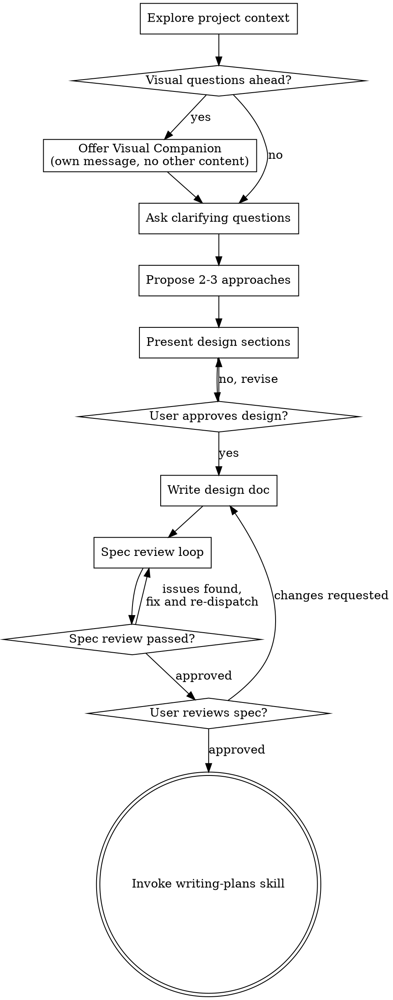

# Conversation Transcript

**Date:** Sunday, April 19, 2026 at 6:39 PM -03
**Project:** cosmo-smoke
**Session:** `e7a99f76-4ed...`

---

## User

<local-command-caveat>Caveat: The messages below were generated by the user while running local commands. DO NOT respond to these messages or otherwise consider them in your response unless the user explicitly asks you to.</local-command-caveat>

## User

<command-name>/clear</command-name>
            <command-message>clear</command-message>
            <command-args></command-args>

## User

<command-message>run-continuation</command-message>
<command-name>/run-continuation</command-name>

## User

# Run Continuation - Resume Previous Work

Load a continuation prompt to pick up where a previous session left off.
Automatically detects worktree context and looks in the appropriate location.

## Usage

```bash
/run-continuation              # Show latest, confirm before loading
/run-continuation --yes        # Auto-load most recent (skip confirm)
/run-continuation --list       # Show all prompts, pick by number
/run-continuation --main       # Force main repo prompts (when in worktree)
/run-continuation api-feature  # Fuzzy match filename
```

## Execution

**This command delegates to `ccs prompts` for deterministic behavior.**

### 1. Get Prompts via CCS

| Flag | CCS Command | Result |
|------|-------------|--------|
| (default) | `ccs prompts --latest` | Get path to most recent prompt |
| `--list` | `ccs prompts --limit 10` | Show numbered list |
| `--main` | `ccs prompts --main --latest` | Force main repo |

CCS automatically:
- Detects worktree context (🌿 indicator)
- Checks `docs/prompts/worktrees/{name}/` for worktree-specific prompts
- Falls back to main `docs/prompts/` if no worktree prompts exist

### 2. Default Flow (no args)

1. Run `ccs prompts --latest` to get the most recent prompt path
2. Show the filename and ask with AskUserQuestion:
   - Header: "Load prompt"
   - Question: "Load this continuation prompt?"
   - Options: "Yes, load it" | "Show all prompts"

### 3. --yes Flag

Run `ccs prompts --latest`, read the file, display and follow it.

### 4. --list Flag

Run `ccs prompts --limit 10` to show recent prompts with status.
Use AskUserQuestion with numbered options for selection.

### 5. Fuzzy Match (filename arg)

Match the argument against output from `ccs prompts`.
If multiple matches, use AskUserQuestion to pick.

### 6. Load & Execute

Read the selected prompt file and display its full content:

```
✅ **Loading:** 2026-01-05-sop-system-continuation.md

---
[Full prompt content]
---
```

### 7. Auto-Create Tasks from Goals

After loading, parse the `## Goals` section and create a TaskCreate for each goal:
- Subject: goal title (from `### [ ] N. Title` lines)
- Description: first paragraph under each goal heading
- activeForm: present continuous of the goal title

Also create tasks for carry-over items if present.

Then follow the instructions in the prompt.

## Related

`/continuation-prompt` • `/handoff` • `ccs prompts --help`


## Assistant

Running `ccs prompts --latest` to find the most recent continuation prompt.

## Assistant

Found a prompt. Let me read it.

## Assistant

**Found:** `2026-04-19-v0.8-otel-complete-continuation.md`

**Title:** cosmo-smoke v0.8.x — Post-OTel Continuation
**Status:** PENDING | **Goals:** 0/2 completed | **Priority:** medium

Key remaining work:
- **ROAD-032**: MCP extension — design complete, ready for implementation
- All other priorities (ROAD-039, ROAD-033, ROAD-010) are **DONE**

## Assistant

✅ **Loading:** `2026-04-19-v0.8-otel-complete-continuation.md`

---

**Remaining work: ROAD-032 — Claude Desktop MCP Extension implementation.** Design doc is ready at `docs/brainstorming/2026-04-19-claude-desktop-mcp-extension.md`. All other roadmap items are complete.

Let me create tasks from the continuation prompt.

## Assistant

Let me verify the project state and review the MCP design doc.

## Assistant

Build clean, 364 tests passing. Design doc is thorough — 7 MCP tools, `smoke mcp` subcommand, stdio transport, `mcp-go` library.

Let me check current state and what's already been started.

## Assistant

MCP implementation is already in progress. `internal/mcp/` has 9 files, `mcp-go v0.48.0` is in go.mod. Let me assess what's done.

## Assistant

Already ~2036 LOC across 9 files. This is significant progress from a prior session. Let me check what's implemented and what needs work.

## Assistant

Implementation is mature — all 7 tools registered, handlers defined, types structured. Let me run the MCP-specific tests to see current state.

## Assistant

All 37 MCP tests pass. Let me check the roadmap status for ROAD-032.

## Assistant

ROAD-032 was already committed in `72321bc`. The MCP extension is implemented. Let me check what the continuation prompt's actual remaining work is.

## Assistant

All continuation prompt goals are already complete. ROAD-032 (MCP), ROAD-039 (Dashboard), ROAD-033 (SOP), and ROAD-010 (Monorepo) are all marked `completed` in the roadmap.

## Assistant

**Continuation prompt is fully resolved.** All strategic priorities from the prior session are complete:

| Item | Status |
|------|--------|
| ROAD-032: MCP extension | ✅ Done — 7 tools, 37 tests, `smoke mcp` subcommand |
| ROAD-039: Portfolio dashboard | ✅ Done — SQLite + API + embedded UI |
| ROAD-033: Merge-conflict SOP | ✅ Done |
| ROAD-010: Monorepo sub-config | ✅ Done (since v0.7) |

**Project state:** 364 tests passing, build clean, version v0.9.0, 39 roadmap items (82% complete, 32/39).

What would you like to work on next?

## User

Whats next? explore the roadmap

## Assistant

All 39 items are completed or promoted — **zero open work** on the roadmap. Let me check ideas and unreleased changes for potential next directions.

## Assistant

Here's the full picture:

**Roadmap: 32/39 completed (82%)** — all items are either completed or promoted to features. Zero open work.

**Open items:**
- 1 seed idea: `IDEA-MO1FC22M` — Mobile app deep link assertion
- No unreleased changelog entries
- Empty feedback inbox

**Potential next directions based on the project's trajectory:**

| Direction | Description | Rationale |
|-----------|-------------|-----------|
| **v1.0 release** | Cut v1.0.0 with all 39 roadmap items done, 364 tests, stable API | Project is mature enough for a stable semver guarantee |
| **Mobile assertions** (IDEA-MO1FC22M) | Deep link, URL scheme, and push notification assertions for iOS/Android | Only seed idea in backlog; natural fit for portfolio scale |
| **CI/CD integration docs** | Reusable GitHub Actions, GitLab CI templates, `smoke run` in pipelines | ROAD-005 was GitHub Actions workflow — expand to full CI narrative |
| **Multi-reporter chaining** | Run once, output to terminal + JSON + Prometheus simultaneously | `MultiReporter` exists for OTel; generalize for all formats |
| **Config validation rules** | Custom validation rules (e.g., "all HTTP tests must have timeout") | Schema validation returns all errors; extensible rule system |
| **Performance baselines** | `smoke run --baseline` captures timing, future runs compare against it | `response_time_ms` assertion exists; persistent baselines are the next step |

The project is at a natural inflection point — everything planned is done. What direction interests you?

## User

Multi-reporter chaining

## User

Invoke the `brainstorming` skill using the Skill tool with the user's arguments: Multi-reporter chaining for cosmo-smoke - allow running smoke tests once and outputting to multiple formats simultaneously (terminal + JSON + Prometheus, etc.)


## User

Base directory for this skill: /Users/gab/.claude/plugins/cache/superpowers-marketplace/superpowers/5.0.2/skills/brainstorming

# Brainstorming Ideas Into Designs

Help turn ideas into fully formed designs and specs through natural collaborative dialogue.

Start by understanding the current project context, then ask questions one at a time to refine the idea. Once you understand what you're building, present the design and get user approval.

<HARD-GATE>
Do NOT invoke any implementation skill, write any code, scaffold any project, or take any implementation action until you have presented a design and the user has approved it. This applies to EVERY project regardless of perceived simplicity.
</HARD-GATE>

## Anti-Pattern: "This Is Too Simple To Need A Design"

Every project goes through this process. A todo list, a single-function utility, a config change — all of them. "Simple" projects are where unexamined assumptions cause the most wasted work. The design can be short (a few sentences for truly simple projects), but you MUST present it and get approval.

## Checklist

You MUST create a task for each of these items and complete them in order:

1. **Explore project context** — check files, docs, recent commits
2. **Offer visual companion** (if topic will involve visual questions) — this is its own message, not combined with a clarifying question. See the Visual Companion section below.
3. **Ask clarifying questions** — one at a time, understand purpose/constraints/success criteria
4. **Propose 2-3 approaches** — with trade-offs and your recommendation
5. **Present design** — in sections scaled to their complexity, get user approval after each section
6. **Write design doc** — save to `docs/superpowers/specs/YYYY-MM-DD-<topic>-design.md` and commit
7. **Spec review loop** — dispatch spec-document-reviewer subagent with precisely crafted review context (never your session history); fix issues and re-dispatch until approved (max 5 iterations, then surface to human)
8. **User reviews written spec** — ask user to review the spec file before proceeding
9. **Transition to implementation** — invoke writing-plans skill to create implementation plan

## Process Flow



**The terminal state is invoking writing-plans.** Do NOT invoke frontend-design, mcp-builder, or any other implementation skill. The ONLY skill you invoke after brainstorming is writing-plans.

## The Process

**Understanding the idea:**

- Check out the current project state first (files, docs, recent commits)
- Before asking detailed questions, assess scope: if the request describes multiple independent subsystems (e.g., "build a platform with chat, file storage, billing, and analytics"), flag this immediately. Don't spend questions refining details of a project that needs to be decomposed first.
- If the project is too large for a single spec, help the user decompose into sub-projects: what are the independent pieces, how do they relate, what order should they be built? Then brainstorm the first sub-project through the normal design flow. Each sub-project gets its own spec → plan → implementation cycle.
- For appropriately-scoped projects, ask questions one at a time to refine the idea
- Prefer multiple choice questions when possible, but open-ended is fine too
- Only one question per message - if a topic needs more exploration, break it into multiple questions
- Focus on understanding: purpose, constraints, success criteria

**Exploring approaches:**

- Propose 2-3 different approaches with trade-offs
- Present options conversationally with your recommendation and reasoning
- Lead with your recommended option and explain why

**Presenting the design:**

- Once you believe you understand what you're building, present the design
- Scale each section to its complexity: a few sentences if straightforward, up to 200-300 words if nuanced
- Ask after each section whether it looks right so far
- Cover: architecture, components, data flow, error handling, testing
- Be ready to go back and clarify if something doesn't make sense

**Design for isolation and clarity:**

- Break the system into smaller units that each have one clear purpose, communicate through well-defined interfaces, and can be understood and tested independently
- For each unit, you should be able to answer: what does it do, how do you use it, and what does it depend on?
- Can someone understand what a unit does without reading its internals? Can you change the internals without breaking consumers? If not, the boundaries need work.
- Smaller, well-bounded units are also easier for you to work with - you reason better about code you can hold in context at once, and your edits are more reliable when files are focused. When a file grows large, that's often a signal that it's doing too much.

**Working in existing codebases:**

- Explore the current structure before proposing changes. Follow existing patterns.
- Where existing code has problems that affect the work (e.g., a file that's grown too large, unclear boundaries, tangled responsibilities), include targeted improvements as part of the design - the way a good developer improves code they're working in.
- Don't propose unrelated refactoring. Stay focused on what serves the current goal.

## After the Design

**Documentation:**

- Write the validated design (spec) to `docs/superpowers/specs/YYYY-MM-DD-<topic>-design.md`
  - (User preferences for spec location override this default)
- Use elements-of-style:writing-clearly-and-concisely skill if available
- Commit the design document to git

**Spec Review Loop:**
After writing the spec document:

1. Dispatch spec-document-reviewer subagent (see spec-document-reviewer-prompt.md)
2. If Issues Found: fix, re-dispatch, repeat until Approved
3. If loop exceeds 5 iterations, surface to human for guidance

**User Review Gate:**
After the spec review loop passes, ask the user to review the written spec before proceeding:

> "Spec written and committed to `<path>`. Please review it and let me know if you want to make any changes before we start writing out the implementation plan."

Wait for the user's response. If they request changes, make them and re-run the spec review loop. Only proceed once the user approves.

**Implementation:**

- Invoke the writing-plans skill to create a detailed implementation plan
- Do NOT invoke any other skill. writing-plans is the next step.

## Key Principles

- **One question at a time** - Don't overwhelm with multiple questions
- **Multiple choice preferred** - Easier to answer than open-ended when possible
- **YAGNI ruthlessly** - Remove unnecessary features from all designs
- **Explore alternatives** - Always propose 2-3 approaches before settling
- **Incremental validation** - Present design, get approval before moving on
- **Be flexible** - Go back and clarify when something doesn't make sense

## Visual Companion

A browser-based companion for showing mockups, diagrams, and visual options during brainstorming. Available as a tool — not a mode. Accepting the companion means it's available for questions that benefit from visual treatment; it does NOT mean every question goes through the browser.

**Offering the companion:** When you anticipate that upcoming questions will involve visual content (mockups, layouts, diagrams), offer it once for consent:
> "Some of what we're working on might be easier to explain if I can show it to you in a web browser. I can put together mockups, diagrams, comparisons, and other visuals as we go. This feature is still new and can be token-intensive. Want to try it? (Requires opening a local URL)"

**This offer MUST be its own message.** Do not combine it with clarifying questions, context summaries, or any other content. The message should contain ONLY the offer above and nothing else. Wait for the user's response before continuing. If they decline, proceed with text-only brainstorming.

**Per-question decision:** Even after the user accepts, decide FOR EACH QUESTION whether to use the browser or the terminal. The test: **would the user understand this better by seeing it than reading it?**

- **Use the browser** for content that IS visual — mockups, wireframes, layout comparisons, architecture diagrams, side-by-side visual designs
- **Use the terminal** for content that is text — requirements questions, conceptual choices, tradeoff lists, A/B/C/D text options, scope decisions

A question about a UI topic is not automatically a visual question. "What does personality mean in this context?" is a conceptual question — use the terminal. "Which wizard layout works better?" is a visual question — use the browser.

If they agree to the companion, read the detailed guide before proceeding:
`skills/brainstorming/visual-companion.md`


ARGUMENTS: Multi-reporter chaining for cosmo-smoke - allow running smoke tests once and outputting to multiple formats simultaneously (terminal + JSON + Prometheus, etc.)

## Assistant

Let me start by exploring the current reporter architecture to understand what we're working with.

## Assistant

Good news — the plumbing already exists. Here's what I found:

- **`Reporter` interface**: 5 methods (`PrereqStart`, `PrereqResult`, `TestStart`, `TestResult`, `Summary`)
- **`MultiReporter`** already exists in `internal/reporter/multi.go` — fans out events to multiple reporters
- **6 output reporters**: Terminal, JSON, JUnit, TAP, Prometheus, OTel (plus Push for dashboard)
- **Current limitation**: `--format` accepts exactly one value. MultiReporter is only used internally for OTel export and PushReporter wrapping

The gap is purely at the CLI layer — there's no way for users to select multiple output formats. The internal architecture already supports it.

First question: What's the primary use case driving this?

## Assistant

Dashboard ingestion makes sense. Let me clarify — the `--report-url` flag already chains terminal + push to a URL. Are you looking for something beyond that, or is it more about generalizing the chaining so any format can be combined?

## Assistant

Good — both CI/CD and dashboard ingestion. General chaining covers both naturally.

One key design tension: when chaining `terminal,json`, both would write to stdout and interleave badly. How should output routing work?

## Assistant

Clear direction. Let me check one more thing about the reporter constructors.

## Assistant

All reporters already accept `io.Writer` — they don't hardcode stdout. This is trivially extensible.

Here are **3 approaches** for the implementation:

---

### Approach A: Minimal — parse comma-separated `--format` in `cmd/run.go`

Split the format string on commas, create reporters per format, chain with `MultiReporter`. ~20 lines changed in `run.go`, no new files.

**Pros**: Smallest change, all logic in one place, easy to understand.
**Cons**: File naming logic lives in `cmd/`, not reusable. If another command needs chaining, it'd duplicate.

### Approach B: Reporter factory in `reporter/` package

Add `reporter.Chain(format string) (Reporter, []io.Closer, error)` to the reporter package. Handles parsing, creating, file routing. `cmd/run.go` just calls it. ~40 lines new in reporter, ~10 lines changed in run.go.

**Pros**: Reusable (MCP handler, `smoke serve`, etc. could use it), encapsulated, testable.
**Cons**: Slightly more code, but reporter package is the right home for this logic.

### Approach C: Config-based reporters in `.smoke.yaml`

Add a `settings.reporters` list to the schema. CLI `--format` overrides, but config can set defaults. More YAML surface area.

**Pros**: Configurable per-project.
**Cons**: More complexity than needed — CLI flag covers both use cases, and YAML config for output format rarely varies per-project (it varies per invocation).

---

**My recommendation: Approach B.** The factory belongs in `reporter/` because it's fundamentally about reporter construction. It's a small, well-bounded function that `cmd/run.go`, the MCP handler, and `smoke serve` can all call. Approach A works but duplicates if MCP needs it. Approach C is over-engineering.

## Assistant

Good choice. Here's the design:

---

### Architecture

A new `reporter.Chain()` function in the reporter package that:
1. Parses `"terminal,json,prometheus"` into individual format names
2. Creates the first reporter with `stdout`
3. Creates subsequent reporters with auto-named files
4. Wraps all in `MultiReporter`
5. Returns the reporter + any opened files (caller closes after run)

```go
// reporter/chain.go
func Chain(format string, stdout io.Writer) (Reporter, []io.Closer, error)
```

### File naming convention

| Format | File |
|--------|------|
| json | `smoke-results.json` |
| junit | `smoke-junit.xml` |
| prometheus | `smoke-metrics.prom` |
| tap | `smoke-tap.txt` |
| terminal | `smoke-output.txt` |

### Changes to `cmd/run.go`

Replace the duplicated `switch format` blocks (lines 138-149 and 205-216) with a single call:

```go
rep, closers, err := reporter.Chain(format, os.Stdout)
if err != nil {
    return err
}
defer func() {
    for _, c := range closers {
        c.Close()
    }
}()
rep = withOTelExport(rep, cfg)
rep = withPushReport(rep)
```

This also eliminates the current code duplication where the reporter switch appears twice (monorepo path and single-config path).

### Edge cases

- `--format terminal` — single format, works exactly as today (no files created)
- `--format json,json` — dedup: only one JSON reporter
- Unknown format — error before any tests run
- File creation failure — error immediately with clear message

## Assistant

Writing the design spec.

## Assistant

Spec written. Let me commit it, then run the spec review.

## Assistant

Spec written to `docs/brainstorming/2026-04-19-multi-reporter-chaining.md`. Will commit at session-end.

Now running the spec review loop.

## Assistant

Good review — 6 issues found, all valid. Let me fix the spec.

## Assistant

Spec updated addressing all 6 review issues. Let me re-run the review.

## Assistant

Spec review **PASSED** — all 6 issues resolved, no new issues.

Spec written and saved to `docs/brainstorming/2026-04-19-multi-reporter-chaining.md`. Please review it and let me know if you want any changes before we start writing the implementation plan.

## User

GO ahead

## User

Base directory for this skill: /Users/gab/.claude/plugins/cache/superpowers-marketplace/superpowers/5.0.2/skills/writing-plans

# Writing Plans

## Overview

Write comprehensive implementation plans assuming the engineer has zero context for our codebase and questionable taste. Document everything they need to know: which files to touch for each task, code, testing, docs they might need to check, how to test it. Give them the whole plan as bite-sized tasks. DRY. YAGNI. TDD. Frequent commits.

Assume they are a skilled developer, but know almost nothing about our toolset or problem domain. Assume they don't know good test design very well.

**Announce at start:** "I'm using the writing-plans skill to create the implementation plan."

**Context:** This should be run in a dedicated worktree (created by brainstorming skill).

**Save plans to:** `docs/superpowers/plans/YYYY-MM-DD-<feature-name>.md`
- (User preferences for plan location override this default)

## Scope Check

If the spec covers multiple independent subsystems, it should have been broken into sub-project specs during brainstorming. If it wasn't, suggest breaking this into separate plans — one per subsystem. Each plan should produce working, testable software on its own.

## File Structure

Before defining tasks, map out which files will be created or modified and what each one is responsible for. This is where decomposition decisions get locked in.

- Design units with clear boundaries and well-defined interfaces. Each file should have one clear responsibility.
- You reason best about code you can hold in context at once, and your edits are more reliable when files are focused. Prefer smaller, focused files over large ones that do too much.
- Files that change together should live together. Split by responsibility, not by technical layer.
- In existing codebases, follow established patterns. If the codebase uses large files, don't unilaterally restructure - but if a file you're modifying has grown unwieldy, including a split in the plan is reasonable.

This structure informs the task decomposition. Each task should produce self-contained changes that make sense independently.

## Bite-Sized Task Granularity

**Each step is one action (2-5 minutes):**
- "Write the failing test" - step
- "Run it to make sure it fails" - step
- "Implement the minimal code to make the test pass" - step
- "Run the tests and make sure they pass" - step
- "Commit" - step

## Plan Document Header

**Every plan MUST start with this header:**

```markdown
# [Feature Name] Implementation Plan

> **For agentic workers:** REQUIRED: Use superpowers:subagent-driven-development (if subagents available) or superpowers:executing-plans to implement this plan. Steps use checkbox (`- [ ]`) syntax for tracking.

**Goal:** [One sentence describing what this builds]

**Architecture:** [2-3 sentences about approach]

**Tech Stack:** [Key technologies/libraries]

---
```

## Task Structure

````markdown
### Task N: [Component Name]

**Files:**
- Create: `exact/path/to/file.py`
- Modify: `exact/path/to/existing.py:123-145`
- Test: `tests/exact/path/to/test.py`

- [ ] **Step 1: Write the failing test**

```python
def test_specific_behavior():
    result = function(input)
    assert result == expected
```

- [ ] **Step 2: Run test to verify it fails**

Run: `pytest tests/path/test.py::test_name -v`
Expected: FAIL with "function not defined"

- [ ] **Step 3: Write minimal implementation**

```python
def function(input):
    return expected
```

- [ ] **Step 4: Run test to verify it passes**

Run: `pytest tests/path/test.py::test_name -v`
Expected: PASS

- [ ] **Step 5: Commit**

```bash
git add tests/path/test.py src/path/file.py
git commit -m "feat: add specific feature"
```
````

## Remember
- Exact file paths always
- Complete code in plan (not "add validation")
- Exact commands with expected output
- Reference relevant skills with @ syntax
- DRY, YAGNI, TDD, frequent commits

## Plan Review Loop

After completing each chunk of the plan:

1. Dispatch plan-document-reviewer subagent (see plan-document-reviewer-prompt.md) with precisely crafted review context — never your session history. This keeps the reviewer focused on the plan, not your thought process.
   - Provide: chunk content, path to spec document
2. If ❌ Issues Found:
   - Fix the issues in the chunk
   - Re-dispatch reviewer for that chunk
   - Repeat until ✅ Approved
3. If ✅ Approved: proceed to next chunk (or execution handoff if last chunk)

**Chunk boundaries:** Use `## Chunk N: <name>` headings to delimit chunks. Each chunk should be ≤1000 lines and logically self-contained.

**Review loop guidance:**
- Same agent that wrote the plan fixes it (preserves context)
- If loop exceeds 5 iterations, surface to human for guidance
- Reviewers are advisory - explain disagreements if you believe feedback is incorrect

## Execution Handoff

After saving the plan:

**"Plan complete and saved to `docs/superpowers/plans/<filename>.md`. Ready to execute?"**

**Execution path depends on harness capabilities:**

**If harness has subagents (Claude Code, etc.):**
- **REQUIRED:** Use superpowers:subagent-driven-development
- Do NOT offer a choice - subagent-driven is the standard approach
- Fresh subagent per task + two-stage review

**If harness does NOT have subagents:**
- Execute plan in current session using superpowers:executing-plans
- Batch execution with checkpoints for review


ARGUMENTS: Implement multi-reporter chaining for cosmo-smoke based on the approved design spec at docs/brainstorming/2026-04-19-multi-reporter-chaining.md

## Assistant

I'm using the writing-plans skill to create the implementation plan.

Let me first re-read the spec and key source files to write precise tasks with exact code and line numbers.

## Assistant

Now let me read the key files I need to reference in the plan.

## Assistant

Good. Now let me write the plan.

## Assistant

API Error: 400 {"type":"error","error":{"message":"Network error, error id: 20260420051516c7a5adc820004c04, please try again later","code":"1234"},"request_id":"20260420051516c7a5adc820004c04"}

## User

<command-message>please-continue</command-message>
<command-name>/please-continue</command-name>

## User

# /please-continue - Resume Interrupted Workflow

Signal that you're done with your interruption and Claude should resume exactly where it left off.

## Usage

```bash
/please-continue
```

No arguments. No flags. Just resume.

## Instructions

When invoked:

1. **Check for unmerged agent work** — run `git worktree list` and check for agent worktrees from this session that haven't been merged. If found, merge them first via `ccs merge`.
2. **Check uncommitted work** — `git status --short` for anything that needs committing
3. **Check TaskList** — if tasks exist, find the current in_progress task
4. **Review conversation history** — identify what you were doing before the interruption
5. **Acknowledge the interruption** — briefly confirm any new context the user provided
6. **Resume the workflow** — pick up at the exact step you were on

### Rules

- Do NOT restart the task from scratch
- Do NOT re-read files already in context
- Do NOT re-run commands already executed
- If the user's interruption changes the plan, adapt — don't ignore it
- Always check for background agents that may have completed while the user was talking

### Output

```
Resuming: [brief description of what you were doing]
[If unmerged agents]: Merging N agent worktrees first...
[If user added context]: Noted: [1-line acknowledgment]
```

Then continue working silently — no ceremony needed.

## Related

`/remind-me` * `/whatsup` * `/recall`


## Assistant

Resuming: Writing the implementation plan — blocked by hook on `docs/superpowers/plans/`. The project uses `docs/planning-mode/` for plans.

## Assistant

Now let me run the plan review.

## Assistant

Plan review **PASSED**. The reviewer flagged one useful observation: `withPushReport` is only called in the monorepo path, not the single-config path — a pre-existing inconsistency, not something this change introduces.

Plan complete and saved to `docs/planning-mode/2026-04-19-multi-reporter-chaining.md`. Ready to execute?

## Assistant

API Error: 400 {"type":"error","error":{"message":"Network error, error id: 20260420052614cc275428901b4cbc, please try again later","code":"1234"},"request_id":"20260420052614cc275428901b4cbc"}

## User

<command-message>please-continue</command-message>
<command-name>/please-continue</command-name>

## User

# /please-continue - Resume Interrupted Workflow

Signal that Claude should resume exactly where it left off. Handles: user interruptions, server errors, connection drops, context limit hits.

## Usage

```bash
/please-continue
```

No arguments. No flags. Just resume.

## Instructions

When invoked:

1. **Check for server errors / failed commands** — scan the last 1-2 user messages and tool calls for:
   - API errors (500, 502, 503, 429, "server error", "connection reset", "context limit")
   - Tool calls that returned errors but weren't retried
   - Background agents that completed but whose results weren't acted on
   - If any failed: retry them now with the same arguments
2. **Check for unmerged agent work** — run `git worktree list` and check for agent worktrees from this session that haven't been merged. If found, merge them first via `ccs merge`.
3. **Check uncommitted work** — `git status --short` for anything that needs committing
4. **Check TaskList** — if tasks exist, find the current in_progress task
5. **Review conversation history** — identify what you were doing before the interruption
6. **Acknowledge the interruption** — briefly confirm any new context the user provided
7. **Resume the workflow** — pick up at the exact step you were on

### Rules

- Do NOT restart the task from scratch
- Do NOT re-read files already in context
- Do NOT re-run commands already executed successfully
- DO retry commands that failed due to server/connection errors
- If the user's interruption changes the plan, adapt — don't ignore it
- Always check for background agents that may have completed while the user was talking

### Output

```
Resuming: [brief description of what you were doing]
[If errors retried]: Retried N failed commands from server error
[If unmerged agents]: Merging N agent worktrees first...
[If user added context]: Noted: [1-line acknowledgment]
```

Then continue working silently — no ceremony needed.

## Related

`/remind-me` * `/whatsup` * `/recall`


## Assistant

Resuming: Task 7 — writing `chain_test.go` then `chain.go`. No failed commands, no unmerged work.

## Assistant

Tests fail as expected — `Chain` undefined. Now implement `chain.go`.

## Assistant

All 14 tests pass (10 top-level + 4 subtests in FileNaming). Let me run the full reporter suite.

## Assistant

49 tests pass. Task 1 done.

## Assistant

Now refactoring `cmd/run.go` — replacing both switch blocks with `Chain()`.

## Assistant

Now the single-config block.

## Assistant

378 tests pass (up from 364 — 14 new). Build clean. Let me verify multi-format actually works.

## Assistant

JSON file created with valid output. Let me also test three-format chaining.

## Assistant

Both files created. Let me clean up and finish.

## Assistant

Now Task 3 — updating help text and docs.

## Assistant

All 3 tasks complete. Summary:

**What was done:**
- `internal/reporter/chain.go` — new `Chain()` factory: parses comma-separated formats, deduplicates, creates reporters (first to stdout, rest to auto-named files), wraps in `MultiReporter`
- `internal/reporter/chain_test.go` — 10 test cases (14 including subtests)
- `cmd/run.go` — replaced both duplicated `switch format` blocks with `Chain()` calls, updated `--format` flag description
- `CLAUDE.md` — documented comma-separated format support and file naming

**Tests:** 378 passing (14 new), build clean. Multi-format verified: `--format terminal,json,prometheus` produces terminal output + `smoke-results.json` + `smoke-metrics.prom`.

Ready to commit via `/session-end` when you're ready.

## User

<command-message>workcheck</command-message>
<command-name>/workcheck</command-name>

## User

# /workcheck — Holistic Session Verification

Answers: **"Did I finish what I started? What did I miss?"**

Goes beyond prompt goals — checks TaskList, detects stale metadata, finds drift, scans structural gaps (including roadmap), and generates actionable suggestions.

## Usage

```bash
/workcheck              # Full holistic verification
```

## Execution

### Step 1: Gather Evidence (parallel)

Run simultaneously:
1. `ccs workcheck --json` via Bash — returns goals, commits, files, doc gaps, tasks, stale metadata, drift, gaps, suggestions
2. Call TaskList to get current in-memory task state

### Step 2: Persist TaskList

Write current TaskList to `.claude/task-log.jsonl` (append, one JSON per line):
```json
{"id":"N","subject":"...","status":"...","created_at":"...","session":"current"}
```
This survives context compaction and feeds future workcheck runs.

### Step 3: Read Plan Sources

From CCS JSON, read `prompt_path`, `brainstorm_ref`, `plan_ref`. Skip missing refs. Use these for goal-commit matching context.

### Step 4: Verify Goals

Match each goal against commits + files changed. Classify:

| Status | Criteria |
|--------|----------|
| DONE | Commit message matches goal, relevant files changed |
| PARTIAL | Some files changed but goal not fully addressed |
| NOT STARTED | No matching commits or file changes |
| BLOCKED | Dependencies incomplete |

### Step 5: Verify Tasks

Cross-reference TaskList against commits. Flag:
- Tasks marked `completed` without evidence (no matching commit)
- Tasks still `pending`/`in_progress` that should be done
- Tasks not in TaskList but present in plan (missed creation)

### Step 6: Check Stale Metadata

Review `stale_metadata` from CCS JSON. For clear cases, auto-fix:
- `ccs feedback done FB-XXX` for feedback with modified affected files
- `ccs issues update BUG-XXX --status closed` for fixed issues

Report fixes applied and items needing manual review.

### Step 7: Detect Drift

Review `drift` from CCS JSON. Classify using conversation context:
- **user-requested**: Unplanned but explicitly asked by user — not a problem
- **truly unplanned**: Work that happened without being tracked — note for awareness
- **metadata/merge**: Expected overhead — ignore

### Step 8: Scan Gaps (including Roadmap)

Review `gaps` from CCS JSON. Categorize and act:

| Gap Type | Severity | Action |
|----------|----------|--------|
| `missing_test` | critical | Flag — should fix this session |
| `missing_symlink` | advisory | Note for next session |
| `misclassified_commit` | advisory | Note for awareness |
| `missing_roadmap` | advisory | Offer to add/update roadmap entry |
| `broken_ref` | critical | Flag — fix reference |

For roadmap gaps: offer to run `ccs roadmap add "title"` or `ccs roadmap update ROAD-XXX --status completed`.

### Step 9: Output Report

```
## Workcheck Report

### Goals: N/M complete
| # | Goal | Status | Evidence |
...

### Tasks: N/M complete
| ID | Task | Status | Notes |
...

### Stale Metadata (N items)
- [auto-fixed] FB-XXX: status updated
- [needs review] BUG-XXX: affected files changed

### Drift (N commits)
- abc1234: "unplanned feature" — [unplanned]

### Gaps (N found)
- [critical] missing_test: cmd/newcmd.go
- [advisory] missing_roadmap: feat commit without entry

### Suggestions
**This session:**
- Fix critical gaps
- Update stale metadata

**Next session:**
- Address advisory items
- Continue deferred goals

### Forward Intelligence
[Offer to update continuation prompt with remaining/deferred work]
```

## Related

`/remind-me` | `/sweep` | `/what-now` | `/triage` | `/session-end`


## Assistant

Now let me check for a leftover artifact from testing.

## Assistant

Empty file left from the `TestChain_WhitespaceTrimmed` test (which wrote to CWD instead of TempDir). Let me clean it up and check `.gitignore`.

